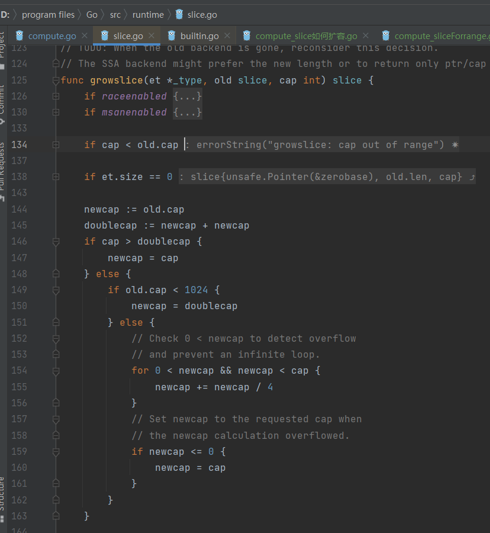

# 数组
## 定义 
- 数组是用来存储`相同唯一类型的`，一组`已编号且长度固定`的序列

## 声明 && 初始化数组
- 数组声明需要`指定元素类型及元素个数`，语法格式如下：
```go
var arr_name [num] arr_type
```
- 声明长度为5 类型为string的数组 `var arr1 [5]string`

- 声明并初始化，不写长度用...代替(不推荐)
- 声明并初始化，写长度
```go
package main
import "fmt"

func main() {

	var arr [5]string
	fmt.Println(arr)

	arr[1] = "golang"
	fmt.Println(arr)

	var arr1 = [...]int{1,2,3}
	fmt.Println(arr1)

	/*
	[    ]
	[ golang   ]
	[1 2 3]
	*/
}
```


## 访问数组元素
- 数组元素可以通过索引（位置）来读取和赋值
- 索引从 0 开始
```go
package main
import "fmt"

func main() {

	var arr1 [10]int
	// 根据索引赋值
	for i := 0; i < 10; i++ {
		arr1[i] = i

	}
	// 根据索引查询数据
	for i := 0; i < 10; i++ {
		fmt.Println(arr1[i])

	}
}

```


- 索引越界  编译检查报错 `invalid array index 20 (out of bounds for 10-element array)`
- 	fmt.Println(arr1[20])


-  索引越界  panic ，用个变量逃避编译检查
    - `panic: runtime error: index out of range [20] with length 10`
    - 用一个变量表示索引，访问

```go
package main
import "fmt"

func main() {
	// 越界
	// .\compute.go:19:18: invalid array index 20 (out of bounds for 10-element array)
	//fmt.Println(arr1[20])

	// 骗过编译器
	// panic: runtime error: index out of range [20] with length 10
	a := 20
	fmt.Println(arr1[a])
}
```


## 指针数组
- 数组的元素除了是某个类型外，还可以是`某个类型的指针`
- `new函数`返回一个TYPE 类型的数据结构划分内存，并执行默认的初始化操作，然后`返回这个数据对象的指针`
```go
package main

import "fmt"

func main() {

	var arr1 [5]*int
	// 根据索引赋值
	arr1[0] = new(int)
	arr1[1] = new(int)
	//arr1[1] = new(int)  // <nil>   panic: runtime error: invalid memory address or nil pointer dereference
	arr1[2] = new(int)
	arr1[3] = new(int)
	arr1[4] = new(int)
	fmt.Println(arr1)
    
	*arr1[0] = 10
	*arr1[1] = 2
	fmt.Println(arr1)
	for i := 0; i < len(arr1); i++ {
		fmt.Printf("[索引：%d 值是: %d]\n", i, *arr1[i])
	}
	/*
	   [0xc00001a098 0xc00001a0b0 0xc00001a0b8 0xc00001a0c0 0xc00001a0c8]
	   [0xc00001a098 0xc00001a0b0 0xc00001a0b8 0xc00001a0c0 0xc00001a0c8]
	   [索引：0 值是: 10]
	   [索引：1 值是: 2]
	   [索引：2 值是: 0]
	   [索引：3 值是: 0]
	   [索引：4 值是: 0]
	*/

}

```

- 只声明不初始化 ，必须用new，空值 panic: runtime error: invalid memory address or nil pointer dereference

- 普通数据深拷贝的例子
    - 判定依据就是 `新老对象的指针%p &var是一致的，说明是浅拷贝`，否则是深拷贝
```go
package main
import "fmt"

func main() {

	arr1 := [2]int{1,2}
	var arr2 [2]int
	arr2 = arr1  // 深copy

	fmt.Printf("arr1[%v %p]\n", arr1, &arr1)
	fmt.Printf("arr2[%v %p]\n", arr2, &arr2)

	arr2[1] = 3   // 浅copy
	fmt.Printf("arr1[%v %p]\n", arr1, &arr1)
	fmt.Printf("arr2[%v %p]\n", arr2, &arr2)
	/*
	arr1[[1 2] 0xc00000a0b0]
	arr2[[1 2] 0xc00000a0c0]
	arr1[[1 2] 0xc00000a0b0]
	arr2[[1 20] 0xc00000a0c0]
	*/
}

```
- 两个数组指针直接复制
    - 原因是`内部存放的是指针`，`指向同一块地址`，直接赋值，内容都一样，看起来是浅拷贝
    - 但是`实数据copy是深拷贝`

```go
package main

import "fmt"

func main() {

	var arr1 [3]*string
	arr2 := [3]*string{new(string), new(string), new(string)}

	*arr2[0] = "k1"
	*arr2[1] = "k2"
	*arr2[2] = "k3"
	arr1 = arr2
	fmt.Println(arr1)
	fmt.Println(arr2)
	for i := 0; i < 3; i++ {
		fmt.Printf("[arr1 :%d :%v %v]\n", i, *arr1[i], arr1[i])
		fmt.Printf("[arr2 :%d :%v %v]\n", i, *arr2[i], arr2[i])
	}
	fmt.Printf("[%v %p]\n", arr1, &arr1)
	fmt.Printf("[%v %p]\n", arr2, &arr2)
	/*
	    [0xc00004c240 0xc00004c250 0xc00004c260]
	   [0xc00004c240 0xc00004c250 0xc00004c260]
	   [arr1 :0 :k1 0xc00004c240]
	   [arr2 :0 :k1 0xc00004c240]
	   [arr1 :1 :k2 0xc00004c250]
	   [arr2 :1 :k2 0xc00004c250]
	   [arr1 :2 :k3 0xc00004c260]
	   [arr2 :2 :k3 0xc00004c260]
	   
	   arr1 [[0xc000040240 0xc000040250 0xc000040260], 0xc000004078]
		arr2 [[0xc000040240 0xc000040250 0xc000040260], 0xc000004090]
	*/
}

```

## 数组的特点
- `固定长度`：这意味着数组不可增长、不可缩减。想要扩展数组，只能创建新数组，将原数组的元素复制到新数组。
- `内存连续`：这意味可以在缓存中保留的时间更长，搜索速度更快，是一种非常高效的数据结构，同时还意味着可以通过数值的方式(arr[index])索引数组中的元素。
- `固定类型`：固定类型意味着限制了每个数组元素可以存放什么样的数据，以及每个元素可以存放多少字节的数据。

## 数组是值类型，就是深拷贝
- 举例 
```go
package main

import "fmt"

func main() {

   arr1 := [2]int{1, 2}
   var arr2 [2]int
   arr2 = arr1
   fmt.Printf("[%v %p]\n", arr1, &arr1)
   fmt.Printf("[%v %p]\n", arr2, &arr2)
   arr2[1] = 20
   fmt.Printf("[%v %p]\n", arr1, &arr1)
   fmt.Printf("[%v %p]\n", arr2, &arr2)
	/*
	arr1[[1 2] 0xc00000a0b0]
	arr2[[1 2] 0xc00000a0c0]
	arr1[[1 2] 0xc00000a0b0]
	arr2[[1 20] 0xc00000a0c0]
	*/
}
```

## 所有的值类型变量，在赋值和作为参数传递时都将产生一次复制

## 把数组传递给函数 数组指针
- 数组是一个值类型，所有的值类型变量在赋值和作为参数传递时都将产生一次复制操作
- 从内存和性能上来看，`在函数间传递数组是一个开销很大的操作`。因为无论这个数组有多长，都会完整复制，并传递给函数
- `数组指针只需要很小传递`

```go
package main

import (
	"fmt"
	"unsafe"
)


func bigArr(arr [1e6]int){
	fmt.Printf("[数组复制：大小%d字节]\n", unsafe.Sizeof(arr))
}

func bigArrPoint(arr *[1e6]int)  {
	fmt.Printf("[数组指针复制：大小%d字节]\n", unsafe.Sizeof(arr))
}

func main() {

	var arr [1e6]int
	bigArr(arr)
	bigArrPoint(&arr)
	
	/*
	[数组复制：大小8000000字节]
	[数组指针复制：大小8字节] 
	// 64位CPU的地址总线可寻址范围 为 0 ~ 2^64-1，代表的存储单元编号的范围
	指针是uint64，故是8字节
	*/
}
```


## 多维数组

- 多维数组的典型用例是平面坐标（二维数组）和三维坐标（三维数组）
- golang的数组本事只有1个维度

```go
package main
import "fmt"

func main(){

	arr1 := [4][2]int{{10,11},{20,21},{30,31},{40,41}}

	fmt.Println(arr1)
	fmt.Println(arr1[2][1])
	
	/*
		[
		[10 11] 
		[20 21] 
		[30 31]  // arr1[2][1]
		[40 41]
		]
	*/
}
```


# 切片

## 切片的内部实现

- 切片是围绕动态数据来构建的
- 数组一旦创建就不能更改长度，但是切片可以控制
- 增长是使用内置的append函数来实现的
- 缩小通过对切片的再次切片来实现


声明初始化

```go
package main

import "fmt"

func main(){

	var s1 []int
	fmt.Println(s1)

	s1 = append(s1, 1)
	s1 = append(s1, 2)
	fmt.Println(s1)
	
	var s2 = []int{12,34,5}
	fmt.Println(s2)

	/*
	[]
	[1 2]
	[12 34 5]
	*/
}
```


使用make

- make([],长度，容量)
- 以类型0值 + 长度的个数填充slice
- 容量不填默认等于长度，如果填了不能小于长度

```go
package main

import "fmt"

func main(){

	// 使用make初始化一个长度为0的slice
	s1 := make([]int, 0)
	s1 = append(s1, 1)
	s1 = append(s1, 2)
	s1 = append(s1, 3)
	fmt.Println(s1)  // [1 2 3]

	// 使用make初始化一个长度为5，容量为5的slice
	s2 := make([]int, 5, 10) // 也是5个
	//s2 := make([]int, 5, 5)  
	//s2 := make([]int, 5, 3)  // : len larger than cap in make([]int)
	fmt.Println(s2)  // [0 0 0 0 0]
	s2 = append(s2, 1)
	s2 = append(s2, 2)
	s2 = append(s2, 3)
	fmt.Println(s2)  // [0 0 0 0 0 1 2 3]
}
```


new和make的对比


## 通过切片创建新的切片

- 语法如下

  ```go
  slice[start:end:cap]
  ```

- 其中start表示从slice第几个元素开始切

- end控制切片的长度(end-start)

- cap控制切片的容量，如果没有给定cap，slice的长度值，则表示切到底层数组的最尾部

- 新切片的长度 = end-start

- 新切片的容量 = cap -start

- cap不能大于原切片的cap

```go
package main

import "fmt"

func main(){

	s1 := []int{1,2,3,4,5,6,7,8,9}
	fmt.Printf("s1[值：%v][新切片的长度=%d 容量=%d]\n", s1,len(s1), cap(s1))
	s2 := s1[2:6]
	fmt.Printf("s1[2:6][从索引为2，第3个元素开始，往后切4个][值：%v][新切片的长度=%d 容量=%d]\n", s2,len(s2), cap(s2))
	s3 :=s1[5:]
	fmt.Printf("s1[5:][从索引为5，第6个元素开始，切到最后][值：%v][新切片的长度=%d 容量=%d]\n", s3,len(s3), cap(s3))
	s4 :=s1[:4]
	fmt.Printf("s1[:4][从开始，切到索引为4，第5个元素结束][值：%v][新切片的长度=%d 容量=%d]\n", s4,len(s4), cap(s4))
	s5 :=s1[:]
	fmt.Printf("s1[:][从开始，切到最后][值：%v][新切片的长度=%d 容量=%d]\n", s5,len(s5), cap(s5))
	s6 :=s1[2:6:6]
	fmt.Printf("s1[2:6:6][从索引为2，第3个元素开始，，往后切4个元素][值：%v][新切片的长度=%d 容量=%d]\n", s6,len(s6), cap(s6))
	s7 :=s1[2:6:9]
	fmt.Printf("s1[2:6:9][从索引为2，第3个元素开始，往后切4个元素][值：%v][新切片的长度=%d 容量=%d]\n", s7,len(s7), cap(s7))

	fmt.Println("切片容量 = cap/end - start")
	
	/*
	
	s1[值：[1 2 3 4 5 6 7 8 9]][新切片的长度=9 容量=9]
	切片容量 = cap/end - start
	s1[2:6][从索引为2，第3个元素开始，往后切4个][值：[3 4 5 6]][新切片的长度=4 容量=7]
	s1[5:][从索引为5，第6个元素开始，切到最后][值：[6 7 8 9]][新切片的长度=4 容量=4]
	s1[:4][从开始，切到索引为4，第5个元素结束][值：[1 2 3 4]][新切片的长度=4 容量=9]
	s1[:][从开始，切到最后][值：[1 2 3 4 5 6 7 8 9]][新切片的长度=9 容量=9]
	s1[2:6:6][从索引为2，第3个元素开始，切到索引为6，第7个元素][值：[3 4 5 6]][新切片的长度=4 容量=4]
	s1[2:6:9][从索引为2，第3个元素开始，切到索引为6，第7个元素][值：[3 4 5 6]][新切片的长度=4 容量=7]
	*/
}
```


### 改变某一个切片的元素

- 说明所有切片的值都变了

```go
	s1[5] = 999
	fmt.Println(s1)
	fmt.Println(s2)
	fmt.Println(s3)
	fmt.Println(s4)
	fmt.Println(s5)
	fmt.Println(s6)
	fmt.Println(s7)
	
	/*
	[1 2 3 4 5 999 7 8 9]
	[3 4 5 999]
	[999 7 8 9]
	[1 2 3 4]
	[1 2 3 4 5 999 7 8 9]
	[3 4 5 999]
	[3 4 5 999]
	*/
```


## 切片是引用类型，浅copy

```go
package main

import "fmt"

func main(){

	a1 := []int{1,2,3}
	a2 := a1

	a1[1] = 10
	fmt.Println(a1, a2)
	a2[2] = 20
	fmt.Println(a1, a2)

	/*
	互相影响，浅copy
	[1 10 3] [1 10 3]
	[1 10 20] [1 10 20]
	*/
}
```


```go
package main

import "fmt"

func main(){

	a1 := []int{1,2,3}
	a2 := make([]int,3)  // 指定长度为3
	a3 := make([]int, 4)
	a4 := make([]int, 2)

	copy(a2, a1)
	copy(a3, a1)
	a1[1] = 10
	fmt.Println(a1, a2)
	a2[2] = 20
	fmt.Println(a1, a2)

	fmt.Println(a1, a3)
	fmt.Println(a1, a4)

	/*
	深copy
	[1 10 3] [1 2 3]
	[1 10 3] [1 2 20]
	[1 10 3] [1 2 3 0]
	[1 10 3] [0 0]
	*/
}
```


## 切片作为参数传给函数

- 虽然函数传参是值传递，应该是深copy
- 但是slice属于引用类型

```go
package main

import "fmt"

func showSlice(s []int)  {
	fmt.Printf("[传入的切片为：%v]\n", s)
	s[2] = 30

}

func main(){
	a1 := []int{1,2,3}
	showSlice(a1)
	fmt.Printf("[函数执行后的切片为：%v]\n", a1)
	
	/*
	[传入的切片为：[1 2 3]]
	[函数执行后的切片为：[1 2 30]]
	*/
}

```


## 切片遍历

- for range遍历

```go
package main

import "fmt"

func main(){

	a1 := []int{10,20,30}
	// 遍历查询
	for index, value := range a1{
		fmt.Printf("[index: %d, value:%d]\n", index, value)
	}
	
	// 遍历修改值
	for index, _ := range a1{
		a1[index] += 100
	}
	fmt.Println(a1)

	/*
	[index: 0, value:10]
	[index: 1, value:20]
	[index: 2, value:30]
	[110 120 130]
	*/
}
```


## 切片扩容和cap字段作用

- cap字段的作用是方便为了扩容
- 假设没有cap只有len，怎么扩容
  - slice长度为10，len=10，元素已经满了，现在要插入第11个元素
  - slice长度为20， len=20, 此时有用的元素只有11个，还有9个空位。
  - slice对外界暴露的接口只有ptr和len=20，如果此时再需要插入元素
  - slice到底应该扩容还是在原有的基础上直接插入呢，如果直接插入从哪个索引插入

```go

package main

import "fmt"

func main(){

	a1 := []int{1,2,3,4}
	fmt.Printf("a1[len: %d, cap: %d]\n", len(a1), cap(a1))
	a2 := append(a1, 5)
	fmt.Printf("a2[len: %d, cap: %d]\n", len(a2), cap(a2))

	a3 := make([]int,1000)
	fmt.Printf("a3[len: %d, cap: %d]\n", len(a3), cap(a3))
	
	a4 := append(a2, a3...)
	fmt.Printf("a4[len: %d, cap: %d]\n", len(a4), cap(a4))
	
	a6 :=append(a4, a3...)
	fmt.Printf("a6[len: %d, cap: %d]\n", len(a6), cap(a6))
	/*
	a1[len: 4, cap: 4]
	a2[len: 5, cap: 8]
	a3[len: 1000, cap: 1000]
	a4[len: 1005, cap: 1024]
	a6[len: 2005, cap: 2560]
	*/
}
```

