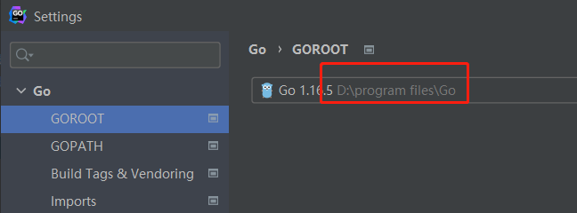
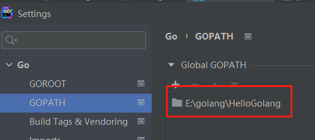
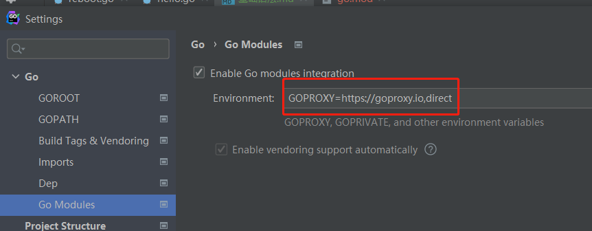

# 课前调查
## 运维开发 or 纯rd

## go言基础掌握情况


# 上课风格
- 代码手敲，最好一起
- 重点知识手敲，敲完群里同步

# 基础的重要性

# goland讲解
## 设置go mod和go proxy
- 先设置1个GOPATH
- 在GOPATH中创建1个project，不要带中文
- 到目录下go mod init
- 设置两个环境变量
- GO111MODULE=ON
- GOPROXY=https://goproxy.io,direct
- 新建go文件，执行


设置GROOT




设置GOPATH




设置gomod

```
E:\golang\HelloGolang\day02>go mod init example
go: creating new go.mod: module example
```




# 内容大纲
- 01 基础语法
- 02 基础数据类型
- 03 字符串
- 04 符合数据类型
- 05 map
- 06 go中的锁
- 07 流程控制


# 01 关键字与标识符

### 标识符的作用
- 用来标识go中的变量名or函数名

### 标识符的命名规范
> 规范
- 以字母or_开头，后面跟着字母，数字，_

> 合法标识符举例
- a_b
- _a
- ab_32d

> 非法标识符举例
- 1ab 以数字开头
- case go里面的关键字
- a+b 带了运算符

### 空白标识符
- _


## 25个关键字


## 36个预定义标识符
- 基本类型的名称
- 一些基本的内置函数


# 02 操作符

## 算数运算符
- 加减乘除  % ++ --

代码如下

```go
package main

import "fmt"

func main() {

	var a = 21
	var b = 10
	var c int
	fmt.Printf("[初始化的值：a=%d,b=%d,c=%d]\n", a, b, c)
	// 加法
	c = a + b
	fmt.Printf("[加法操作：a+b = %d]\n", c)
	// 减法
	c = a - b
	fmt.Printf("[减法操作：a-b=%d]\n", c)
	// 乘法
	c = a * b
	fmt.Printf("[乘法操作 a*b=%d]\n", c)
	// 除法
	c = a / b
	fmt.Printf("[除法操作 a/b=%d]\n", c)
	// 取余
	c = a % b
	fmt.Printf("[取余操作 a%%b=%d]\n", c)
	// 自增
	c++
	fmt.Printf("[取余操作 c++ =%d]\n", c)
	// 自减
	c--
	fmt.Printf("[取余操作 c--=%d]\n", c)
	/**
	[初始化的值：a=21,b=10,c=0]
	[加法操作：a+b = 31]
	[减法操作：a-b=11]
	[乘法操作 a*b=210]
	[除法操作 a/b=2]
	[取余操作 a%b=1]
	[取余操作 c++ =2]
	[取余操作 c--=1]
	**/
}

```


## 关系运算法

- < > !=  ==

```go
package main

import "fmt"

func main()  {
	var a = 10
	var b = 5
	if a>b{
		fmt.Printf("a>b")
	}
}
```


## 逻辑运算符

- &&逻辑 AND 运算符
- || 逻辑OR运算符
- ！逻辑 NOT运算符

```go
package main

import "fmt"

func main()  {
	var a = true
	var b = false
	if a && b{
		fmt.Printf("[ab 同为true，才为true]\n")
	}
	if a || b{
		fmt.Printf("[ab 中有1个true，才为true]\n")
	}
	if !(a && b){
		fmt.Printf("[ab 同时不为true，才为true]\n")
	}
}
```


## 位运算符

- 与操作 & 二进制同为1，结果为1
- 或操作 | 二进制至少1个为1，结果为1
- 异或操作 ^  二进制不同时，结果为1
- 左移操作 <<  左移n位就是乘以2的n次方
- 右移操作 >>  左移n位就是除以2的n次方

 ```go
 package main
 
 import "fmt"
 
 func main()  {
 
 	var a uint = 60
 	var b uint = 13
 	var c uint = 0
 
 	fmt.Printf("[a=%d 二进制=%08b]\n", a, a)
 	fmt.Printf("[b=%d 二进制=%08b]\n", b, b)
 
 	c = a&b
 	fmt.Printf("[与操作][%d=%d&%d] %08b=%08b&%08b \n", c,a,b,c,a, b)
 	c = a|b
 	fmt.Printf("[或操作][%d=%d|%d] %08b=%08b|%08b \n", c,a,b,c,a, b)
 	c = a^b
 	fmt.Printf("[异或操作][%d=%d^%d] %08b=%08b^%08b \n", c,a,b,c,a, b)
 	c = a<<b
 	fmt.Printf("[左移放大操作][%d=%d<<%d] %08b=%08b<<%08b \n", c,a,b,c,a, b)
 	c = a>>b
 	fmt.Printf("[右移缩小操作][%d=%d>>%d] %08b=%08b>>%08b \n", c,a,b,c,a, b)
 
 /**
   [a=60 二进制=00111100]
   [b=13 二进制=00001101]
   [与操作][12=60&13] 00001100=00111100&00001101
   [或操作][61=60|13] 00111101=00111100|00001101
   [异或操作][49=60^13] 00110001=00111100^00001101
   [左移放大操作][491520=60<<13] 1111000000000000000=00111100<<00001101
   [右移缩小操作][0=60>>13] 00000000=00111100>>00001101
   **/
 }
 ```


## 赋值运算符

- += -= *= ...

```go

package main

import "fmt"

func main()  {

	var a = 21
	var c int

	c = a
	fmt.Println(c, a)
	c += a
	fmt.Println(c, a)
	c *= a
	fmt.Println(c, a)
	
	/**
	21 21
	42 21
	882 21
	**/
}
```

## 关于指针的运算符

- & 返回变量存储地址。可以使用%p去打印地址
- 指针变量 * ， `var a *int`
  1. 用来定义变量，类型是指针的
  2. 可以对指针地址再赋值或取值

```go
package main

import "fmt"

func main()  {

	var a int = 4
	var ptr *int
	fmt.Printf("[a变量类型为 %T]\n", a)
	fmt.Printf("[ptr变量类型为 %T]\n",ptr)


	ptr = &a
	fmt.Printf("[a变量的值为 %d]\n", a)
	fmt.Printf("[*ptr变量的值为 %d]\n", *ptr)
	fmt.Printf("[ptr变量的值为 %v]\n", ptr)
	fmt.Printf("[a的指针地址为 %p]\n", &a)

	/*
	[a变量类型为 int]
	[ptr变量类型为 *int]
	[a变量的值为 4]
	[*ptr变量的值为 4]
	[ptr变量的值为 0xc0000ac058]
	[a的指针地址为 0xc0000ac058]
	*/

}
```

# 03 变量、常量、枚举

## 变量

### 方法一：使用var 声明变量并初始化

- 关键字var可以使用结构类型声明变量，并初始化为零值，举例

```golang
var p int
```

- 关键字 var 创建了类型为 int 且名为 p 的变量，p被称作类型 int 的一个实例(instance)。

- 当声明变量时，这个变量对应的值总是会被初始化。
- 使用var关键字用零值初始化，对数值类型来说，零值是 0；对字符串来说，零值是空字符串；对布尔类型，零值是 false。
- 多变量声明 `var a,b,c,d string`

#### var 等号 ：使用自定义数据初始化 

- `var p int = 10`

#### var特点：可以在函数外部使用，可以声明初始化全局变量

- 举例使用 var=XXXX 初始化全局缓存


### 方法二：使用短变量声明操作符(:=) 初始化

#### 特点1：使用自定义值初始化

- `p:=10`

#### 特点2：不可以在函数外部使用，不可以声明初始化全局变量

- 可以试一试  .\compute.go:8:1: syntax error: non-declaration statement outside function body

```go
package main

import "fmt"

var A int
var B int = 10

//cc := 10   .\compute.go:8:1: syntax error: non-declaration statement outside function body
var cc = 10

func main()  {

	var a int
	var b string
	var c bool
	var d = 4
	fmt.Println(a,b,c,d)

	/*
	0  false 4
	*/
}
```


## 常量：const定义的

- 定义在全局的位置，函数外部
- 常量必须赋值，否则报错Missing value in const declaration

```go
package main

import "fmt"


const Pi = 3.1415
const Max float64 = 1000.1111
const cname = "go编程"
// const dname  .\compute.go:14:7: missing value in const declaration

const (
	Pi1 = 3.1415
	Max2 float64 = 1000.1111
	cname3 = "go编程"
)


```

## 枚举

go中没有enum这么一个关键字来定义。而是依靠const和iota

```go
package main
import "fmt"

const (
	a = iota
	b
	c
	d
)

func main()  {
	fmt.Println(a,b,c,d)   // 0 1 2 3
}

```

- 自定义类型

  ```go
  package main
  import "fmt"
  
  type MyType int
  const (
  	T1 MyType = iota
  	T2
  	T3
  	T4
  )
  
  
  func main()  {
  	fmt.Println(T1, T2, T3, T4)  // 0 1 2 3
  }
  
  ```

- _ 可以跳过值

  ```go
  package main
  
  import "fmt"
  
  type MyType int
  
  const (
  	T1 MyType = iota
  	T2
  	_
  	_
  	T3
  	T4
  )
  
  func main() {
  
  	fmt.Println(T1, T2, T3, T4) //0 1 4 5
  
  }
  ```

- 中间插值iota会被覆盖掉，不再继续自增。但是用另一个iota接一下，又会继续自增

  ```go
  package main
  import "fmt"
  
  const (
  	a = iota
  	b = 5
  	c
  	d = iota
  	e
  )
  
  func main() {
  	fmt.Println(a, b, c, d, e) //0 5 5   3 4
  }
  ```

- 位掩码表达式

  ```go
  package main
  
  import "fmt"
  
  type MyType int
  
  const (
  	T1 MyType = 1 << iota
  	T2
  	_
  	_
  	T3
  	T4
  )
  
  func main() {
  	fmt.Println(T1, T2, T3, T4) //1 2 16 32
  }
  ```

  

- 定义数量级，比如说字节大小

  ```go
  package main
  
  import "fmt"
  
  type MyType int
  
  const (
  	_ = iota
  	KB float64 = 1 << (10 * iota)
  	MB
  	GB
  	TB
  )
  
  func main() {
  
  	fmt.Println(KB, MB, GB, TB) //1024 1.048576e+06 1.073741824e+09 1.099511627776e+12
  	fmt.Println(1 << 10)
  }
  ```

  


## 04 变量作用域

- 在golang中，变量作用域，分为：本地局部变量、全局变量、参数变量


### 本地局部变量

- 在函数 if、for等定义的变量
- 生效范围：定义在函数里面，则在整个函数范围有效；定义在语义块，则在整个语义块生效

```go
package main

import "fmt"

func T1() string {
	str1 := "函数中的字符串变量"
	fmt.Println(str1)
	return str1
}

func main()  {
	// 试图引用在函数里面定义的变量
	// .\compute.go:12:14: undefined: str1
	//fmt.Println(str1)

	for i := 0; i < 10 ; i++{
		fmt.Println(i)
	}
	// 试图引用在for里面定义的变量
	// .\compute.go:19:14: undefined: i
	//fmt.Println(i)

	if str := T1(); str == "" {
		fmt.Println("[函数返回为空]")
	}
	str := T1()
	if str == ""{}
	// 试图引用在if里面定义的变量
	// .\compute.go:28:14: undefined: str
	//fmt.Println(str)
}

```


### 全局变量

 申明在函数外部的变量，所有内部的都可以调用

```go
package main

import "fmt"

var QUANJUBL string = "我是全局变量"

func T1() string {
	str1 := "函数中的字符串变量"
	fmt.Println(str1)
	fmt.Println(QUANJUBL)
	return str1
}

func main()  {

	for i := 0; i < 10 ; i++{
		fmt.Println(i)
		fmt.Println(QUANJUBL)
	}

	if str := T1(); str == "" {
		fmt.Println("[函数返回为空]")
		fmt.Println(QUANJUBL)
	}

}

```


### 参数变量


