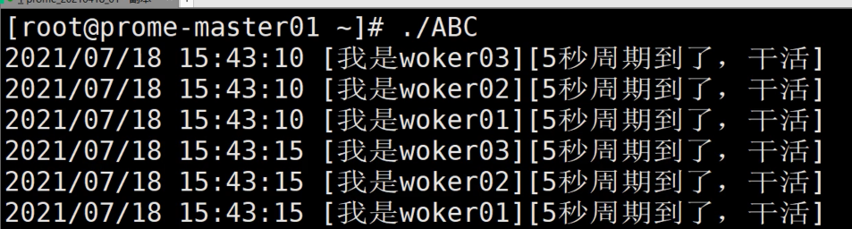
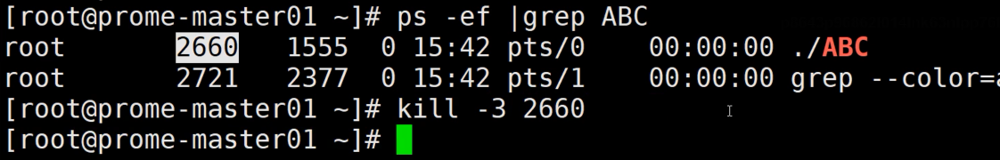

# channel
- Channel是Go中的一个核心类型
- 你可以把它看成一个管道

## 像 map 和 slice 数据类型一样, channel必须先创建再使用:

```go
ch := make(chan int)
```

## 箭头的指向就是数据的流向

```go
ch <- v    // 发送值v到Channel ch中
v := <-ch  // 从Channel ch中接收数据，并将数据赋值给v
```


## channel可进行3种操作
- 读
- 写
- 关闭


## channel存在3种状态：
- `nil ,未初始化的状态`： 只用var 只声明了，或者手动赋值为nil
- `active ,正常的channel` 。可以读或写
- `closed ，已关闭的`。它的值不是nil


## 同步模式 
- channel默认为同步模式，即不创建缓冲区，发送和接收需要一一配对，不然发送方会被一直阻塞

```go
package main

import (
	"log"
	"time"
)

func main()  {

	// 初始化一个int类型的channel
	data := make(chan int)

	//读取数据的任务
	go func() {
		for {
			r := <- data
			log.Printf("[接收到了数据,开始处理]：%v", r)

		}
	}()


	// 写入数据
	data <- 1
	time.Sleep(2*time.Second)
	data <-2
	time.Sleep(2*time.Second)
	close(data)
	log.Println("关闭channel")
	
	/*
	2021/08/08 09:07:11 [接收到了数据,开始处理]：1
	2021/08/08 09:07:13 [接收到了数据,开始处理]：2
	2021/08/08 09:07:15 关闭channel
	*/
}

```


> 使用range遍历
- 使用`for-range读取channel，这样既安全又便利`，当channel关闭时，for循环会自动退出，无需主动监测channel是否关闭，可以防止读取已经关闭的channel，造成读到数据为通道所存储的数据类型的零值。
-  如果不加最后这个sleep ， chan 关闭了不会打印
```go
package main

import (
	"log"
	"time"
)

func main() {

	// 初始化一个类型为int的chan
	data := make(chan int)
	// 读取数据的任务
	go func() {
		for r := range data {
			log.Printf("[接收到了数据,开始处理]：%v", r)
		}
		log.Printf("chan 关闭了")
	}()

	// 写入数据
	data <- 1
	time.Sleep(2 * time.Second)
	data <- 2
	time.Sleep(2 * time.Second)
	data <- 3
	time.Sleep(2 * time.Second)
    
	close(data)
    
	// 现象是	chan 关闭了没打印
	// 如果加上	time.Sleep(1 * time.Second) 就会打印
	time.Sleep(1 * time.Second)
    
}

```


> 使用 if双返回值判断 chan是否被关闭
- ok=false通道关闭，无数据读到。

```go
package main

import (
	"log"
	"time"
)

func main() {

	// 初始化一个类型为int的chan
	data := make(chan int)
	// 读取数据的任务
	go func() {
		for {
			if r, ok := <-data; ok {
				log.Printf("[接收到了数据,开始处理]：%v", r)
			} else {
				log.Printf("chan 关闭了")
				break
			}

		}
	}()

	// 写入数据
	data <- 1
	time.Sleep(2 * time.Second)
	data <- 2
	time.Sleep(2 * time.Second)
	data <- 3
	time.Sleep(2 * time.Second)
    
	close(data)
	// 现象是	chan 关闭了没打印
	// 如果加上	time.Sleep(1 * time.Second) 就会打印
	time.Sleep(1 * time.Second)
}

	/*
	2021/08/08 09:15:08 [接收到了数据,开始处理]：1
	2021/08/08 09:15:09 [接收到了数据,开始处理]：2
	2021/08/08 09:15:10 没有数据了，chan 关闭了
	2021/08/08 09:15:11 没有数据了，chan 关闭了
	2021/08/08 09:15:12 没有数据了，chan 关闭了
	*/

```


## 异步模式
- 异步模式channel有缓冲区
- `如果缓冲区已满，发送的主进程或者协程会被阻塞`
- 如果未满不会被阻塞
- 如果为空，接收的协程会被阻塞
- 基于这种性质往往需要`有个同步channel去控制主进程是否退`出，否则有可能协程还未处理完所有的信息，主进程已经退出 
- 代码
```go
package main

import (
	"log"
	"time"
)

func main() {

	// 初始化一个类型为int的chan ,缓冲区为3
	data := make(chan int, 3)
	quit := make(chan bool) // 达成和最后的time.sleep一样的效果 阻主线程，防止异步任务中有未处理完的就推出
	// 读取数据的任务
	go func() {
		for d := range data {
			time.Sleep(2 * time.Second)
			log.Printf("[接收到了数据,开始处理]：%v", d)

		}
		log.Printf("data chan关闭了，但是我还有清理工作，等我5秒钟")
		time.Sleep(5 * time.Second)
		// 本任务处理完了，告诉主线程可以退出了
		quit <- true
	}()

	// 写入数据
	data <- 1
	time.Sleep(2 * time.Second)
	data <- 2
	time.Sleep(2 * time.Second)
	data <- 3
	time.Sleep(2 * time.Second)
	data <- 4
	log.Printf("发送4")
	data <- 5
	log.Printf("发送5")
	data <- 6
	log.Printf("发送6")
	data <- 7
	log.Printf("发送7")
	data <- 8
	log.Printf("发送8")
	data <- 9
	log.Printf("发送9")
	close(data)
	<-quit
	log.Printf("真正退出了")
}

/*
2021/08/08 09:22:00 [接收到了数据,开始处理]：1
2021/08/08 09:22:03 [接收到了数据,开始处理]：2
2021/08/08 09:22:03 发送4
2021/08/08 09:22:03 发送5
2021/08/08 09:22:03 发送6
2021/08/08 09:22:05 [接收到了数据,开始处理]：3
2021/08/08 09:22:05 发送7
2021/08/08 09:22:07 [接收到了数据,开始处理]：4
2021/08/08 09:22:07 发送8
2021/08/08 09:22:09 [接收到了数据,开始处理]：5
2021/08/08 09:22:09 发送9
2021/08/08 09:22:11 [接收到了数据,开始处理]：6
2021/08/08 09:22:13 [接收到了数据,开始处理]：7
2021/08/08 09:22:15 [接收到了数据,开始处理]：8
2021/08/08 09:22:17 [接收到了数据,开始处理]：9
2021/08/08 09:22:17 data chan关闭了，但是我还有清理工作，等我5秒钟
2021/08/08 09:22:22 真正退出了

Process finished with the exit code 0

*/
```


> 从一个close的chan 中读取到的是0值
-  如果改成 for { <-data} 这样去读取
- 在chan被关闭之后就是读取到的就是0值
```go
package main

import (
	"log"
	"time"
)

func main() {

	// 初始化一个类型为int的chan ,缓冲区为3
	data := make(chan int, 3)
	quit := make(chan bool) // 达成和最后的time.sleep一样的效果 阻主线程，防止异步任务中有未处理完的就推出
	// 读取数据的任务
	go func() {
		for d := range data {
			time.Sleep(2 * time.Second)
			log.Printf("[接收到了数据,开始处理]：%v", d)

		}
		log.Printf("data chan关闭了，但是我还有清理工作，等我5秒钟")
		log.Printf("data chan关闭了，我再读取几个值看看:%v", <-data)
		log.Printf("data chan关闭了，我再读取几个值看看:%v", <-data)
		log.Printf("data chan关闭了，我再读取几个值看看:%v", <-data)

		time.Sleep(5 * time.Second)
		// 本任务处理完了，告诉主线程可以退出了
		quit <- true
	}()

	// 写入数据
	data <- 1
	time.Sleep(2 * time.Second)
	data <- 2
	time.Sleep(2 * time.Second)
	data <- 3
	time.Sleep(2 * time.Second)
	data <- 4
	log.Printf("发送4")
	data <- 5
	log.Printf("发送5")
	data <- 6
	log.Printf("发送6")
	data <- 7
	log.Printf("发送7")
	data <- 8
	log.Printf("发送8")
	data <- 9
	log.Printf("发送9")
	close(data)
	<-quit
	log.Printf("真正退出了")
}

/*
2021/08/08 09:24:18 [接收到了数据,开始处理]：1
2021/08/08 09:24:20 发送4
2021/08/08 09:24:20 发送5
2021/08/08 09:24:20 [接收到了数据,开始处理]：2
2021/08/08 09:24:20 发送6
2021/08/08 09:24:22 [接收到了数据,开始处理]：3
2021/08/08 09:24:24 [接收到了数据,开始处理]：4
2021/08/08 09:24:26 [接收到了数据,开始处理]：5
2021/08/08 09:24:28 [接收到了数据,开始处理]：6
2021/08/08 09:24:28 data chan关闭了，但是我还有清理工作，等我5秒钟
2021/08/08 09:24:28 data chan关闭了，我再读取几个值看看:0
2021/08/08 09:24:28 data chan关闭了，我再读取几个值看看:0
2021/08/08 09:24:28 data chan关闭了，我再读取几个值看看:0
2021/08/08 09:24:33 真正退出了

Process finished with the exit code 0

*/
```


## 几种会导致panic的 chan操作
> 01 close nil 的chan

> 02 向已关闭的chan 再次close

> 03 向已关闭的chan 再次写入值
```go
package main

func main() {
	// panic: close of nil channel
	//var c1 chan int
	//close(c1)

	// panic: close of closed channel
	//c2 := make(chan int)
	//close(c2)
	//close(c2)

	// panic: send on closed channel
	c3 := make(chan int)
	close(c3)
	c3 <- 1
}

```

## select 和close 
- close(ch) 通知所有下游协程 :watch 这个ch的worker
- 使用select处理多个channel
- select可以同时监控多个通道的情况，只处理未阻塞的case。当通道为nil时，对应的case永远为阻塞，无论读写
```go
package main

import (
	"log"
	"os"
	"os/signal"
	"syscall"
	"time"
)

var quitC = make(chan struct{})

func signalWork()  {
	c := make(chan os.Signal, 1)
	signal.Notify(c, syscall.SIGINT, syscall.SIGTERM, syscall.SIGQUIT)

	// 当c中读取到值的时候，说明有人发了信号
	sig := <- c
	
	// 通知所有读取quitC的任务
	close(quitC)
	time.Sleep(2*time.Second)
	log.Printf("接收到了停止的信号,信号是%v，pod:=%d, 要退出了",sig, os.Getpid())
}

func work01()  {
	ticker := time.NewTicker(5*time.Second)
	for{
		select{
		case <- ticker.C:
			log.Printf("[我是woker01][5秒周期到了，干活]")

		case <- quitC:
			log.Printf("[我是woker01][接受到主进程退出的信号]。进行清理操作")
			return
		}
	}
}

func work02()  {
	ticker := time.NewTicker(5*time.Second)
	for{
		select{
		case <- ticker.C:
			log.Printf("[我是woker02][5秒周期到了，干活]")

		case <- quitC:
			log.Printf("[我是woker02][接受到主进程退出的信号]。进行清理操作")
			return
		}
	}
}

func work03()  {
	ticker := time.NewTicker(5*time.Second)
	for{
		select{
		case <- ticker.C:
			log.Printf("[我是woker02][5秒周期到了，干活]")

		case <- quitC:
			log.Printf("[我是woker02][接受到主进程退出的信号]。进行清理操作")
			return
		}
	}
}

func main() {

	go work01()
	go work02()
	go work03()

	signalWork()
}

/*
2021/08/08 09:45:47 [我是woker02][5秒周期到了，干活]
2021/08/08 09:45:47 [我是woker01][5秒周期到了，干活]
2021/08/08 09:45:47 [我是woker02][5秒周期到了，干活]
2021/08/08 09:45:52 [我是woker02][5秒周期到了，干活]
2021/08/08 09:45:52 [我是woker02][5秒周期到了，干活]
2021/08/08 09:45:52 [我是woker01][5秒周期到了，干活]
2021/08/08 09:45:53 [我是woker01][接受到主进程退出的信号]。进行清理操作
2021/08/08 09:45:53 [我是woker02][接受到主进程退出的信号]。进行清理操作
2021/08/08 09:45:53 [我是woker02][接受到主进程退出的信号]。进行清理操作
2021/08/08 09:45:53 接收到了停止的信号,信号是interrupt，pod:=3004, 要退出了

Process finished with the exit code 0

*/
```


## 实战演练

```go
vim test.go

go run test.go

# 编译为二进制
go build -o ABC test.go

# 执行二进制
./ABC
```





