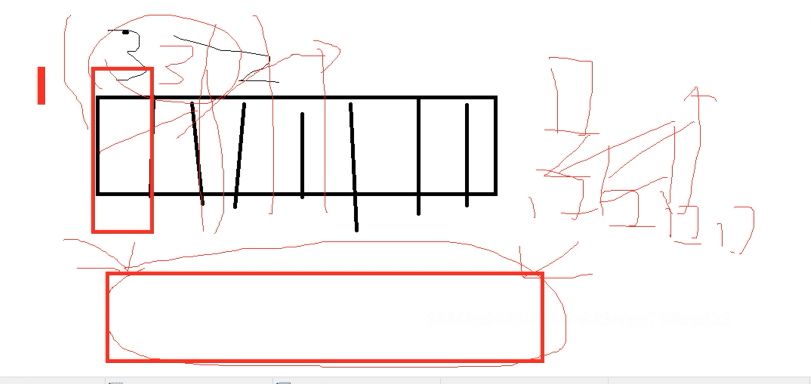

# map 使用

## 声明和初始化

### 使用var只声明

```go
// 只声明
var gMap map[string]string
```

### 使用var声明并初始化

```go
// 声明并初始化
var hMap = map[string][string]{"a":"b"}
```

### 使用make初始化


## 增删改查

### 增加和删除

### 修改

### 读取数据

两种手段

- 第1种，单变量 lang := m["lang"]，没有key就附1个value类型的0值
- 第2种，双变量 app2, exists := m["app2"] 可以根据exists判断true代表有key

### 增删改查举例

```go
package main

import "fmt"

// 只声明
var m1 map[string]string

// 声明并初始化
var m2 = map[string]string{"a":"b"}

func main(){

	m:=make(map[string]string)

	// 增加，如何批量增加呢？
	m["app"] = "taobao"
	m["lang"] = "golang"

	// 删除
	delete(m, "app")

	// 改
	m["lang"] = "python"

	// 查
	// 单变量形式
	lang := m["lang"]
	fmt.Println(lang)
	// 双变量形式
	lang, exists := m["lang"]
	if exists{
		fmt.Printf("[lang存在，值：%v]\n", lang)
	}
	if !exists{
		fmt.Printf("[lang不存在]\n")
		m["lang"] = "vue"
	}
	fmt.Println(m)

}
```


### 遍历map、按key的顺序遍历 

```go

package main

import "fmt"

func main(){

	m1 := make(map[string]int)

	// 遍历赋值
	keys := make([]string, 0)
	for i:=0; i<10;i++{
		key := fmt.Sprintf("key_%d", i)
		m1[key] = i
		keys = append(keys, key)
	}
	fmt.Println(m1)

	
	for k := range m1{
		fmt.Printf("[key=%s]\n", k)
	}


	// range遍历取值
	fmt.Println("无序遍历")
	for k,v:= range m1{
		fmt.Printf("[%s=%d]\n", k,v)
	}

	// 有序key遍历
	fmt.Println("有序遍历")
	for _,key := range keys{
		fmt.Printf("[%s=%d]\n", key, m1[key])
	}

    	
	// slice排序
	keys2 := []string{"c","a","b"}
	sort.Sort(sort.StringSlice(keys2))
	fmt.Println(keys2)
	
	/*
	[a b c]
	*/
    
}
```

## key的类型: float64可以作为key吗？

> 所有类型的都可以作为key吗？

- bool、int、string
- 特征是 支持 == 和 !== 比较
- float类型可以作为key，写入map时，会做math.Float64bits() 的转换，认为2.4=2.4000xxx1，看起来是同一个key

```go
package main

import "fmt"

func main(){

	m := make(map[float64] int)

	m[2.4] = 2
	fmt.Printf("k:%v, v:%d\n", "2.4000000000000001", m[2.4000000000000001])
	fmt.Println(m[2.4] == m[2.4000000000000001])
	
	/*
	k:2.4000000000000001, v:2
	true
	*/
}
```

## 二维map

- map的value是个map，每一层都要make

- value的类型：任意类型

```go
package main

import "fmt"

func main(){
	var doubleM  map[string]map[string]string
	// panic: assignment to entry in nil map

	doubleM = make(map[string]map[string]string)
	v1 := make(map[string]string)
	v1["k1"] = "v1"

	doubleM["m1"] = v1

	fmt.Println(doubleM)
	/*
	map[m1:map[k1:v1]]
	*/

}
```

## go原生map线程不安全

### fatal error :concurrent map read and map write

```go
package main

import "time"

func main(){

	c := make(map[int]int)

	// 匿名goroutine 循环map
	go func() {
		for i:=0;i<10000;i++{
			c[i] = i
		}
	}()

	// 匿名goroutine 循环读map
	go func() {
		for i:=0;i<10000;i++{
			_ = c[i]
		}
	}()

	time.Sleep(40*time.Minute)

	/*
	fatal error: concurrent map read and map write

	goroutine 6 [running]:
	*/
}
```

### fatal error: concurrent map writes

```go
package main

import "time"

func main(){

	c := make(map[int]int)

	// 匿名goroutine 循环写map
	go func() {
		for i:=0;i<10000;i++{
			c[i] = i
		}
	}()

	// 匿名goroutine 循环写map
	go func() {
		for i:=0;i<10000;i++{
			c[i] = i
		}
	}()
	

	time.Sleep(40*time.Minute)

	/*
		fatal error: concurrent map writes

		goroutine 5 [running]:
	*/

}
```

### 上述问题原因

- go原生的map线程不安全 具体原因情况 go中的锁.md

### 解决方法之一 加锁

- 使用读写锁

### 解决方法之二 使用sync.map

- go 1.9引入的内置方法，并发线程安全的map
- sync.Map 将key和value 按照interface{}存储
- 查询出来后要类型断言 x.(int) x.(string)
- 遍历使用Range() 方法，需要传入一个匿名函数作为参数，匿名函数的参数为k,v interface{}，每次调用匿名函数将结果返回。

- 举例

```go
package main

import (
	"fmt"
	"log"
	"strings"
	"sync"
)

func main(){
	m := sync.Map{}

	// 新增
	for i:=0; i<10;i++{
		key := fmt.Sprintf("key_%d",i)
		m.Store(key,i)
	}

	//删除
	m.Delete("key_8")

	// 修改
	m.Store("key_9",999)

	// 查询
	res, loaded := m.Load("key_09")
	if loaded{
		// 类型断言 res.(int)
		log.Printf("[key_09存在：%v 数字类型:%d]", res, res.(int))
	}

	// 遍历 return  false停止
	m.Range(func(key, value interface{}) bool {
		k := key.(string)
		v := value.(int)
		if strings.HasSuffix(k, "3"){
			log.Printf("不想要3")
			//return false  // 停止
			return true
		}else{
			log.Printf("[sync.map.Range][遍历][key=%s][ v=%d]", k,v)
			return true
		}
	})

	// LoadAndDelete先获取值，在删除
	s1, loaded := m.LoadAndDelete("key_7")
	log.Printf("key_7 LoadAndDelete %v\n",s1)


	s2, loaded := m.Load("key_7")
	log.Printf("key_7 LoadAndDelete:%v", s2)

	//LoadOrStore 先获取值，没有的话新增，有的话返回
	actual, loaded := m.LoadOrStore("key_88", 888)
	if loaded{
		log.Printf("key_88原来的值是:%v", actual)
	}else{
		log.Printf("key_88原来没有，实际是:%v", actual)
	}

	actual, loaded = m.LoadOrStore("key_3", 333)
	if loaded{
		log.Printf("key_3原来的值是:%v", actual)
	}else{
		log.Printf("key_3原来没有，实际是:%v", actual)
	}

	/*
	2021/08/07 11:57:44 [sync.map.Range][遍历][key=key_0][ v=0]
	2021/08/07 11:57:44 [sync.map.Range][遍历][key=key_2][ v=2]
	2021/08/07 11:57:44 [sync.map.Range][遍历][key=key_6][ v=6]
	2021/08/07 11:57:44 [sync.map.Range][遍历][key=key_1][ v=1]
	2021/08/07 11:57:44 不想要3
	2021/08/07 11:57:44 [sync.map.Range][遍历][key=key_4][ v=4]
	2021/08/07 11:57:44 [sync.map.Range][遍历][key=key_5][ v=5]
	2021/08/07 11:57:44 [sync.map.Range][遍历][key=key_7][ v=7]
	2021/08/07 11:57:44 [sync.map.Range][遍历][key=key_9][ v=999]

	2021/08/07 11:57:44 key_7 LoadAndDelete 7
	2021/08/07 11:57:44 key_7 LoadAndDelete:<nil>

	2021/08/07 11:57:44 key_88原来没有，实际是:888
	2021/08/07 11:57:44 key_3原来的值是:3


	*/
}
```


### sync.map使用 总结


### sync.map 性能对比

- https://studygolang.com/articles/27515

- 性能对比结论

```shell script
只读场景：sync.map > rwmutex >> mutex
读写场景（边读边写）：rwmutex > mutex >> sync.map
读写场景（读80% 写20%）：sync.map > rwmutex > mutex
读写场景（读98% 写2%）：sync.map > rwmutex >> mutex
只写场景：sync.map >> mutex > rwmutex
```

- sync.Map使用场景的建议
  - 读多：给定的key-v只写一次，但是读了很多次，只增长的缓存场景
  - key不相交： 覆盖更新的场景比少
- 结构体复杂的case多不用sync.Map

> 上述两种手段有什么问题

- 没有精细化锁控制，没有分片
- 加了大锁


###  分片锁 并发map github.com/orcaman/concurrent-map

- 基础用法


```go
# 工作目录,创建go.mod
go mod init

# 下载包
go mod tidy
```





### 带过期时间的map

- 为什么要有过期时间
- map做缓存用的 垃圾堆积k1  k2 
- 希望缓存存活时间 5分钟，
- 将加锁的时间控制在最低，
- 耗时的操作在加锁外侧做

```go
package main

import (
	"fmt"
	"log"
	"sync"
	"time"
)

// 带过期时间的map定时器
type Cache struct {
	sync.RWMutex
	mp map[string]*item
}

type item struct {
	value int  // 值
	ts int64   // 时间戳，item被创建出来的时间
}

func (c *Cache) Get(key string) *item  {
	c.RLock()
	defer c.RUnlock()
	return c.mp[key]
}

func (c *Cache)Set(key string, value *item)  {
	c.Lock()
	defer c.Unlock()
	c.mp[key] = value
}

// 获取cache中map的数量
func (c *Cache) CacheNum() int  {
	c.RLock()
	defer c.RUnlock()
	return len(c.mp)
}

// 清除过期的值
func (c *Cache) clean(timeDelta int64)  {
	// 每5秒执行一次
	for{
		now := time.Now().Unix()
		toDeleteKeys := make([]string, 0) // 待删除的key的切片

		// 先加读锁，把所有待删除的拿到
		c.RLock()
		for k,v:= range c.mp{
			// 时间比较
			// 认为这个k,v过期了,
			// 不直接删除，为了降低加锁时间，加入待删除的切片
			if now - v.ts > timeDelta{
				toDeleteKeys = append(toDeleteKeys, k)
			}
		}
		c.RUnlock()

		// 加写锁 删除,降低加写锁的时间
		c.Lock()
		for _, k := range toDeleteKeys{
			log.Printf("[删除过期数据][key:%s]", k)
			delete(c.mp, k)
		}
		c.Unlock()

		time.Sleep(2 * time.Second)
	}

}

func main() {

	c:=Cache{
		mp: make(map[string] *item),
	}

	// 让清理的任务异步执行
	// 每2秒运行一次，检查时间差大于30秒item 就删除
	go c.clean(30)


	// 设置缓存，30s后过期
	// 从mysql中读取到了数据，塞入缓存
	for i:=0;i<10;i++{

		now := time.Now().Unix()
		im := &item{
			value: i,
			ts: now,
		}

		key := fmt.Sprintf("key_%d", i)

		log.Printf("[设置缓存][item][key:%s][v:%v]", key, im)
		c.Set(key, im)
	}

	log.Printf("缓存中的数据量:%d", c.CacheNum())
	time.Sleep(36 * time.Second)
	log.Printf("缓存中的数据量:%d", c.CacheNum())

	// 更新缓存，30s后过期
	for i:=0; i<5;i++{
		now := time.Now().Unix()
		im := &item{
			value: i,
			ts: now,
		}

		key := fmt.Sprintf("key_%d", i)

		log.Printf("[更新缓存][item][key:%s][v:%v]", key, im)
		c.Set(key, im)
	}
	log.Printf("缓存中的数据量:%d", c.CacheNum())

	select{}

}


/*
2021/08/07 17:44:29 [设置缓存][item][key:key_0][v:&{0 1628329469}]
2021/08/07 17:44:29 [设置缓存][item][key:key_1][v:&{1 1628329469}]
2021/08/07 17:44:29 [设置缓存][item][key:key_2][v:&{2 1628329469}]
2021/08/07 17:44:29 [设置缓存][item][key:key_3][v:&{3 1628329469}]
2021/08/07 17:44:29 [设置缓存][item][key:key_4][v:&{4 1628329469}]
2021/08/07 17:44:29 [设置缓存][item][key:key_5][v:&{5 1628329469}]
2021/08/07 17:44:29 [设置缓存][item][key:key_6][v:&{6 1628329469}]
2021/08/07 17:44:29 [设置缓存][item][key:key_7][v:&{7 1628329469}]
2021/08/07 17:44:29 [设置缓存][item][key:key_8][v:&{8 1628329469}]
2021/08/07 17:44:29 [设置缓存][item][key:key_9][v:&{9 1628329469}]
2021/08/07 17:44:29 缓存中的数据量:10

2021/08/07 17:45:01 [删除过期数据][key:key_0]
2021/08/07 17:45:01 [删除过期数据][key:key_1]
2021/08/07 17:45:01 [删除过期数据][key:key_4]
2021/08/07 17:45:01 [删除过期数据][key:key_5]
2021/08/07 17:45:01 [删除过期数据][key:key_7]
2021/08/07 17:45:01 [删除过期数据][key:key_2]
2021/08/07 17:45:01 [删除过期数据][key:key_3]
2021/08/07 17:45:01 [删除过期数据][key:key_6]
2021/08/07 17:45:01 [删除过期数据][key:key_8]
2021/08/07 17:45:01 [删除过期数据][key:key_9]

2021/08/07 17:45:05 缓存中的数据量:0
2021/08/07 17:45:05 [更新缓存][item][key:key_0][v:&{0 1628329505}]
2021/08/07 17:45:05 [更新缓存][item][key:key_1][v:&{1 1628329505}]
2021/08/07 17:45:05 [更新缓存][item][key:key_2][v:&{2 1628329505}]
2021/08/07 17:45:05 [更新缓存][item][key:key_3][v:&{3 1628329505}]
2021/08/07 17:45:05 [更新缓存][item][key:key_4][v:&{4 1628329505}]
2021/08/07 17:45:05 缓存中的数据量:5

2021/08/07 17:45:37 [删除过期数据][key:key_2]
2021/08/07 17:45:37 [删除过期数据][key:key_0]
2021/08/07 17:45:37 [删除过期数据][key:key_1]
2021/08/07 17:45:37 [删除过期数据][key:key_3]
2021/08/07 17:45:37 [删除过期数据][key:key_4]

*/
```


### 带过期时间的缓存 github.com/patrickmn/go-cache 

```go
package main

import (
	"fmt"
	"github.com/patrickmn/go-cache"
	"time"
)


func main() {
	// Create a cache with a default expiration time of 5 minutes, and which
	// purges expired items every 10 minutes
	// 创建过期的30s缓存，每5秒清理一次
	c := cache.New(30*time.Second, 5*time.Second)

	// Set the value of the key "foo" to "bar", with the default expiration time
	c.Set("foo", "bar", 10*time.Second)

	res,ok := c.Get("foo")
	fmt.Println(res, ok)
	time.Sleep(10*time.Second)

	res,ok = c.Get("foo")
	fmt.Println(res, ok)

	/*
	   bar true
	   <nil> false
	
	*/
}
```


```go
package main

import (
	"fmt"
	"github.com/patrickmn/go-cache"
	"log"
	"time"
)

/*
生产上用的 web缓存应用

维护用户信息的模块
在mysql中有1张user表

正常情况下，用orm，gorm，xorm去db中查询
查询qps很高，为了性能会加缓存
(更新不会太频繁)，说明在一定时间内，获取到旧数据也能容忍
*/

type user struct {
	Name string
	Email string
	Phone int64
}

var (
	DefaultInterval = time.Minute * 1
	UserCache = cache.New(DefaultInterval, DefaultInterval)
)

// http请求接口查询，mock模拟
func HttpGetUser(name string) user  {
	u := user{
		Name: name,
		Email: "qq.com",
		Phone: time.Now().Unix(),
	}
	return u
}

// 最外层调用函数
// 优先去本地缓存中查，有就返回
// 没有再去远端查询，远端用http请求表示
func GetUser(name string) user  {

	// 消耗 0.1cpu 0.1M内存 0.1秒返回
	res,found := UserCache.Get(name)
	if found{
		log.Printf("[本地缓存中找到了对应的用户][name：%v][value:%v]", name, res.(user))
		return res.(user)

	}else{
	// 消耗 1cpu 10M内存 3秒返回
		// 本地没有，但是从远端拿到了最新的数据
		// 更新本地缓存 ,我种树，其他人乘凉
		res := HttpGetUser(name)
		UserCache.Set(name, res, DefaultInterval)
		log.Printf("[本地缓存中没找到对应的用户，去远端查询获取到了，塞入缓存中][name：%v][value:%v]", name, res)
		return res
	}
}

// 查询方法
func queryUser()  {
	for i:=0 ;i<10;i++{
		userName  := fmt.Sprintf("user_name%d", i)
		GetUser(userName)
	}
}

func main()  {
	log.Printf("第1次query_user")
	queryUser()

	log.Printf("第2次query_user")
	queryUser()
	queryUser()

	time.Sleep(61*time.Second)
	log.Printf("第3次query_user")
	queryUser()
}


/*
2021/08/07 18:38:16 第1次query_user
2021/08/07 18:38:16 [本地缓存中没找到对应的用户，去远端查询获取到了，塞入缓存中][name：user_name0][value:{user_name0 qq.com 1628332696}]
2021/08/07 18:38:16 [本地缓存中没找到对应的用户，去远端查询获取到了，塞入缓存中][name：user_name1][value:{user_name1 qq.com 1628332696}]
2021/08/07 18:38:16 [本地缓存中没找到对应的用户，去远端查询获取到了，塞入缓存中][name：user_name2][value:{user_name2 qq.com 1628332696}]
2021/08/07 18:38:16 [本地缓存中没找到对应的用户，去远端查询获取到了，塞入缓存中][name：user_name3][value:{user_name3 qq.com 1628332696}]
2021/08/07 18:38:16 [本地缓存中没找到对应的用户，去远端查询获取到了，塞入缓存中][name：user_name4][value:{user_name4 qq.com 1628332696}]
2021/08/07 18:38:16 [本地缓存中没找到对应的用户，去远端查询获取到了，塞入缓存中][name：user_name5][value:{user_name5 qq.com 1628332696}]
2021/08/07 18:38:16 [本地缓存中没找到对应的用户，去远端查询获取到了，塞入缓存中][name：user_name6][value:{user_name6 qq.com 1628332696}]
2021/08/07 18:38:16 [本地缓存中没找到对应的用户，去远端查询获取到了，塞入缓存中][name：user_name7][value:{user_name7 qq.com 1628332696}]
2021/08/07 18:38:16 [本地缓存中没找到对应的用户，去远端查询获取到了，塞入缓存中][name：user_name8][value:{user_name8 qq.com 1628332696}]
2021/08/07 18:38:16 [本地缓存中没找到对应的用户，去远端查询获取到了，塞入缓存中][name：user_name9][value:{user_name9 qq.com 1628332696}]
2021/08/07 18:38:16 第2次query_user
2021/08/07 18:38:16 [本地缓存中找到了对应的用户][name：user_name0][value:{user_name0 qq.com 1628332696}]
2021/08/07 18:38:16 [本地缓存中找到了对应的用户][name：user_name1][value:{user_name1 qq.com 1628332696}]
2021/08/07 18:38:16 [本地缓存中找到了对应的用户][name：user_name2][value:{user_name2 qq.com 1628332696}]
2021/08/07 18:38:16 [本地缓存中找到了对应的用户][name：user_name3][value:{user_name3 qq.com 1628332696}]
2021/08/07 18:38:16 [本地缓存中找到了对应的用户][name：user_name4][value:{user_name4 qq.com 1628332696}]
2021/08/07 18:38:16 [本地缓存中找到了对应的用户][name：user_name5][value:{user_name5 qq.com 1628332696}]
2021/08/07 18:38:16 [本地缓存中找到了对应的用户][name：user_name6][value:{user_name6 qq.com 1628332696}]
2021/08/07 18:38:16 [本地缓存中找到了对应的用户][name：user_name7][value:{user_name7 qq.com 1628332696}]
2021/08/07 18:38:16 [本地缓存中找到了对应的用户][name：user_name8][value:{user_name8 qq.com 1628332696}]
2021/08/07 18:38:16 [本地缓存中找到了对应的用户][name：user_name9][value:{user_name9 qq.com 1628332696}]
2021/08/07 18:38:16 [本地缓存中找到了对应的用户][name：user_name0][value:{user_name0 qq.com 1628332696}]
2021/08/07 18:38:16 [本地缓存中找到了对应的用户][name：user_name1][value:{user_name1 qq.com 1628332696}]
2021/08/07 18:38:16 [本地缓存中找到了对应的用户][name：user_name2][value:{user_name2 qq.com 1628332696}]
2021/08/07 18:38:16 [本地缓存中找到了对应的用户][name：user_name3][value:{user_name3 qq.com 1628332696}]
2021/08/07 18:38:16 [本地缓存中找到了对应的用户][name：user_name4][value:{user_name4 qq.com 1628332696}]
2021/08/07 18:38:16 [本地缓存中找到了对应的用户][name：user_name5][value:{user_name5 qq.com 1628332696}]
2021/08/07 18:38:16 [本地缓存中找到了对应的用户][name：user_name6][value:{user_name6 qq.com 1628332696}]
2021/08/07 18:38:16 [本地缓存中找到了对应的用户][name：user_name7][value:{user_name7 qq.com 1628332696}]
2021/08/07 18:38:16 [本地缓存中找到了对应的用户][name：user_name8][value:{user_name8 qq.com 1628332696}]
2021/08/07 18:38:16 [本地缓存中找到了对应的用户][name：user_name9][value:{user_name9 qq.com 1628332696}]

2021/08/07 18:39:17 第3次query_user
2021/08/07 18:39:17 [本地缓存中没找到对应的用户，去远端查询获取到了，塞入缓存中][name：user_name0][value:{user_name0 qq.com 1628332757}]
2021/08/07 18:39:17 [本地缓存中没找到对应的用户，去远端查询获取到了，塞入缓存中][name：user_name1][value:{user_name1 qq.com 1628332757}]
2021/08/07 18:39:17 [本地缓存中没找到对应的用户，去远端查询获取到了，塞入缓存中][name：user_name2][value:{user_name2 qq.com 1628332757}]
2021/08/07 18:39:17 [本地缓存中没找到对应的用户，去远端查询获取到了，塞入缓存中][name：user_name3][value:{user_name3 qq.com 1628332757}]
2021/08/07 18:39:17 [本地缓存中没找到对应的用户，去远端查询获取到了，塞入缓存中][name：user_name4][value:{user_name4 qq.com 1628332757}]
2021/08/07 18:39:17 [本地缓存中没找到对应的用户，去远端查询获取到了，塞入缓存中][name：user_name5][value:{user_name5 qq.com 1628332757}]
2021/08/07 18:39:17 [本地缓存中没找到对应的用户，去远端查询获取到了，塞入缓存中][name：user_name6][value:{user_name6 qq.com 1628332757}]
2021/08/07 18:39:17 [本地缓存中没找到对应的用户，去远端查询获取到了，塞入缓存中][name：user_name7][value:{user_name7 qq.com 1628332757}]
2021/08/07 18:39:17 [本地缓存中没找到对应的用户，去远端查询获取到了，塞入缓存中][name：user_name8][value:{user_name8 qq.com 1628332757}]
2021/08/07 18:39:17 [本地缓存中没找到对应的用户，去远端查询获取到了，塞入缓存中][name：user_name9][value:{user_name9 qq.com 1628332757}]

*/
```


# map的实际应用 


# map的原理


## map底层原理文章推荐

- https://zhuanlan.zhihu.com/p/66676224
- https://segmentfault.com/a/1190000039101378
- https://draveness.me/golang/docs/part2-foundation/ch03-datastructure/golang-hashmap/

