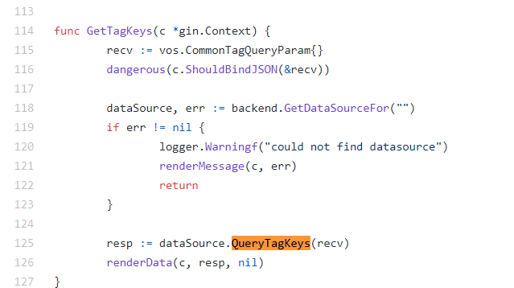
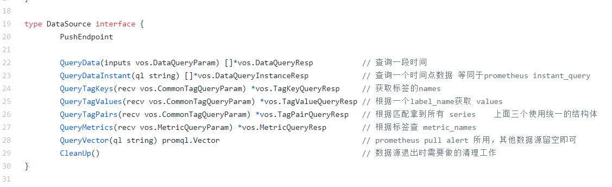

# 面向对象
- go没有class关键字，oop，但是我们可以把go当做面向对象的方式来编程
- go没有类，可以把`struct作为类看待`
- 类的方法是啥： `给struct绑定的方法`

## 继承
- 通过结构体的匿名嵌套，继承对应的字段和方法，举例
```go
package main

import (
	"log"
)

type Person struct {
	Name string
	Age  int
}

type Student struct {
	Person
	StudentId int
}

// 给Person结构体绑定一个SayHello
func (p Person) SayHello() {
	log.Printf("[Person.SayHello][name:%v]", p.Name)
}

func main() {
	p1 := Person{
		Name: "小乙",
		Age:  123,
	}

	s1 := Student{
		Person:    p1,
		StudentId: 99,
	}
	s1.SayHello()
	
    s2 := Student{
		Person:    Person{
			Name: "alex",
			Age : 33
		},
		StudentId: 0,
	}
    s2.SayHello()
}

/*
2021/08/10 23:54:30 [Person.SayHello][name:小乙]
2021/08/10 23:54:30 [Person.SayHello][name:alex]
*/
```

##  结构体单例绑定  
```go
package main

import (
   "log"
)

type Person struct {
   Name string
   Age  int
}

type Student struct {
   Person
   StudentId int
}

// 给Person结构体绑定一个SayHello
func (p Person) SayHello() {
   log.Printf("[Person.SayHello][name:%v]", p.Name)
}

func (p *Person) ChangeAge1() {
   p.Age += 10
   log.Printf("[单实例绑定方法][Person.ChangeAge1][p.Age:%v]", p.Age)
}
func (p Person) ChangeAge2() {
   p.Age += 10
   log.Printf("[多实例][非指针型绑定][Person.ChangeAge2][p.Age:%v]", p.Age)
}

func main() {
   p1 := Person{
      Name: "小乙",
      Age:  123,
   }

   s1 := Student{
      Person:    p1,
      StudentId: 99,
   }
   s1.SayHello()
   log.Println(s1.Age)
   s1.ChangeAge1()
   log.Println(s1.Age)


   log.Println(s1.Age)
   s1.ChangeAge2()
   log.Println(s1.Age)
}

/*
go 单实例，把值的地址传递进去，直接修改的是原数据

go 函数默认值传递，传递的是一份copy
 */
```


## 多态 ：通过接口做多态
### go接口
- interface{} 定义方法的集合
- 多态体现在，各个结构体对象要实现 接口中定义的所有方法
- 统一的函数调用入口 ，传入的接口
- 各个结构体对象中 绑定的方法只能多不能少于 接口定义的
- 方法的签名要一致：参数类型、参数个数，方法名称，函数返回值要一致

### 多态的灵魂 是什么
- `是有一个承载的容器，先把所有实现了接口的对象添加进来。遍历容器调用对应的方法`

- 举例
```go
package main

import "log"

// 体现多态
// 告警通知的函数，根据不同的对象进行通知
//
type notifer interface {
	// 通知方法
	notify()
}

type user struct {
	name  string
	email string
}

func (u *user) notify() {
	log.Printf("[普通用户的通知][notify to user :%s]", u.name)
}

type admin struct {
	name string
	age  int
}

func (u *admin) notify() {
	log.Printf("[管理员的通知][notify to user :%s]", u.name)
}

// 多态的统一调用入口
func sendNotify(n notifer) {
	n.notify()
}

func main() {

	u1 := user{
		name:  "小乙",
		email: "xy@qq.com",
	}
	a1 := admin{
		name: "燕青",
		age:  18,
	}
	// 直接调用结构体绑定的方法
	log.Println("直接调用结构体绑定的方法")
	u1.notify()
	a1.notify()
    
	// 体现多态
	log.Println("体现多态")
	sendNotify(&u1)
	sendNotify(&a1)
    
	// 灵魂
	log.Println("多态灵魂承载容器")
	ns := make([]notifer, 0)
	ns = append(ns, &a1)
	ns = append(ns, &u1)
	for _, n := range ns {
		n.notify()  // 不管n是什么对象，执行同样的方法
	}

}

2021/08/11 00:53:04 直接调用结构体绑定的方法
2021/08/11 00:53:04 [普通用户的通知][notify to user :小乙]
2021/08/11 00:53:04 [管理员的通知][notify to user :燕青]
2021/08/11 00:53:04 体现多态
2021/08/11 00:53:04 [普通用户的通知][notify to user :小乙]
2021/08/11 00:53:04 [管理员的通知][notify to user :燕青]
2021/08/11 00:53:04 多态灵魂承载器
2021/08/11 00:53:04 [普通用户的通知][notify to user :小乙]
2021/08/11 00:53:04 [管理员的通知][notify to user :燕青]

Process finished with the exit code 0

```

### 实际应用 prometheus 的alert和record


### 夜莺真实的使用场景

https://github.com/didi/nightingale/blob/master/http/router_ts_data.go

https://github.com/didi/nightingale/blob/master/backend/datasource.go





## 常用举例 ，多个数据源推送数据和查询数据
- 举例
```go
package main

import (
	"fmt"
	"log"
)

// 多个数据源推送数据和查询数据

// 1、定义接口interface
// query 查询数据
// push 写入数据
type DataSource interface {
	Push(data string)
	Query(name string) string
}

// 2、定义struct
// 定义redis结构体和两个方法
type redis struct {
	Name string
	Addr string
}

func (r *redis) Push(data string)  {
	// 真实应该推入它消息队列
	log.Printf("[Pushdata][ds.name:%s][data:%s]", r.Name, data)
}

func (r *redis) Query(name string)string  {
	log.Printf("[Query.data][ds.name:%s][name:%s]", r.Name, name)
	return name +"-"+ r.Name
}

// 定义kafka结构体和两个方法
type kafka struct {
	Name string
	Addr string
}

func (k *kafka) Push(data string) {
	// 真实应该推入它消息队列
	log.Printf("[Pushdata][ds.name:%s][data:%s]", k.Name, data)
}

func (k *kafka) Query(name string) string  {
	log.Printf("[Query.data][ds.name:%s][name:%s]", k.Name, name)
	return name +"-"+ k.Name
}

// 3、定义方法
// 灵魂容器
var DataSourceManager = make(map[string]DataSource)

// 注册方法
func register(name string, ds DataSource) {
	DataSourceManager[name] = ds
}


func main()  {

	r := redis{
		Name: "redis-6.0",
		Addr: "1.1",
	}
	k := kafka{
		Name: "kafka-2.11",
		Addr: "2.2",
	}
	// 将数据源注册到承载的容器中
	register("redis", &r)
	register("kafka", &k)

	// 模拟推送数据
	for i := 0; i < 10; i++ {
		key := fmt.Sprintf("key_%d", i)
		for _, ds := range DataSourceManager {
			ds.Push(key)
		}
	}
	// 查询数据
	for i := 0; i < 10; i++ {
		key := fmt.Sprintf("key_%d", i)
		for _, ds := range DataSourceManager {
			log.Println(ds.Query(key))
		}
	}

}


/*
2021/08/11 07:37:23 [Pushdata][ds.name:redis-6.0][data:key_0]
2021/08/11 07:37:23 [Pushdata][ds.name:kafka-2.11][data:key_0]
2021/08/11 07:37:23 [Pushdata][ds.name:redis-6.0][data:key_1]
2021/08/11 07:37:23 [Pushdata][ds.name:kafka-2.11][data:key_1]
2021/08/11 07:37:23 [Pushdata][ds.name:redis-6.0][data:key_2]
2021/08/11 07:37:23 [Pushdata][ds.name:kafka-2.11][data:key_2]
2021/08/11 07:37:23 [Pushdata][ds.name:kafka-2.11][data:key_3]
2021/08/11 07:37:23 [Pushdata][ds.name:redis-6.0][data:key_3]
2021/08/11 07:37:23 [Pushdata][ds.name:redis-6.0][data:key_4]
2021/08/11 07:37:23 [Pushdata][ds.name:kafka-2.11][data:key_4]
2021/08/11 07:37:23 [Pushdata][ds.name:redis-6.0][data:key_5]
2021/08/11 07:37:23 [Pushdata][ds.name:kafka-2.11][data:key_5]
2021/08/11 07:37:23 [Pushdata][ds.name:kafka-2.11][data:key_6]
2021/08/11 07:37:23 [Pushdata][ds.name:redis-6.0][data:key_6]
2021/08/11 07:37:23 [Pushdata][ds.name:redis-6.0][data:key_7]
2021/08/11 07:37:23 [Pushdata][ds.name:kafka-2.11][data:key_7]
2021/08/11 07:37:23 [Pushdata][ds.name:redis-6.0][data:key_8]
2021/08/11 07:37:23 [Pushdata][ds.name:kafka-2.11][data:key_8]
2021/08/11 07:37:23 [Pushdata][ds.name:redis-6.0][data:key_9]
2021/08/11 07:37:23 [Pushdata][ds.name:kafka-2.11][data:key_9]
2021/08/11 07:37:23 [Query.data][ds.name:redis-6.0][name:key_0]
2021/08/11 07:37:23 key_0-redis-6.0
2021/08/11 07:37:23 [Query.data][ds.name:kafka-2.11][name:key_0]
2021/08/11 07:37:23 key_0-kafka-2.11
2021/08/11 07:37:23 [Query.data][ds.name:redis-6.0][name:key_1]
2021/08/11 07:37:23 key_1-redis-6.0
2021/08/11 07:37:23 [Query.data][ds.name:kafka-2.11][name:key_1]
2021/08/11 07:37:23 key_1-kafka-2.11
2021/08/11 07:37:23 [Query.data][ds.name:redis-6.0][name:key_2]
2021/08/11 07:37:23 key_2-redis-6.0
2021/08/11 07:37:23 [Query.data][ds.name:kafka-2.11][name:key_2]
2021/08/11 07:37:23 key_2-kafka-2.11
2021/08/11 07:37:23 [Query.data][ds.name:redis-6.0][name:key_3]
2021/08/11 07:37:23 key_3-redis-6.0
2021/08/11 07:37:23 [Query.data][ds.name:kafka-2.11][name:key_3]
2021/08/11 07:37:23 key_3-kafka-2.11
2021/08/11 07:37:23 [Query.data][ds.name:redis-6.0][name:key_4]
2021/08/11 07:37:23 key_4-redis-6.0
2021/08/11 07:37:23 [Query.data][ds.name:kafka-2.11][name:key_4]
2021/08/11 07:37:23 key_4-kafka-2.11
2021/08/11 07:37:23 [Query.data][ds.name:redis-6.0][name:key_5]
2021/08/11 07:37:23 key_5-redis-6.0
2021/08/11 07:37:23 [Query.data][ds.name:kafka-2.11][name:key_5]
2021/08/11 07:37:23 key_5-kafka-2.11
2021/08/11 07:37:23 [Query.data][ds.name:redis-6.0][name:key_6]
2021/08/11 07:37:23 key_6-redis-6.0
2021/08/11 07:37:23 [Query.data][ds.name:kafka-2.11][name:key_6]
2021/08/11 07:37:23 key_6-kafka-2.11
2021/08/11 07:37:23 [Query.data][ds.name:redis-6.0][name:key_7]
2021/08/11 07:37:23 key_7-redis-6.0
2021/08/11 07:37:23 [Query.data][ds.name:kafka-2.11][name:key_7]
2021/08/11 07:37:23 key_7-kafka-2.11
2021/08/11 07:37:23 [Query.data][ds.name:kafka-2.11][name:key_8]
2021/08/11 07:37:23 key_8-kafka-2.11
2021/08/11 07:37:23 [Query.data][ds.name:redis-6.0][name:key_8]
2021/08/11 07:37:23 key_8-redis-6.0
2021/08/11 07:37:23 [Query.data][ds.name:kafka-2.11][name:key_9]
2021/08/11 07:37:23 key_9-kafka-2.11
2021/08/11 07:37:23 [Query.data][ds.name:redis-6.0][name:key_9]
2021/08/11 07:37:23 key_9-redis-6.0

Process finished with the exit code 0

*/
```


夜空接口

- 所有的类型都实现了空接口

## 类型断言 和类型判断
- 一个interface 需要类型转换的时候，语法 i.(T) 
- v,ok:=i.(T) ，`ok=true代表断言成功`，`ok=false v是这个类型的0值`
- 举例
```go
package main

import "fmt"

// 类型断言和判断

func main()  {

	var s interface{} = "abc"
	s1, ok := s.(string)
	fmt.Println(s1, ok)
	s2, ok := s.(int)
	fmt.Println(s2, ok)

	var i interface{} = 123
	i1, ok := i.(int)
	fmt.Println(i1, ok)
	i2, ok := i.(string)
	fmt.Println(i2, ok)

	
	// s.(type) 判断类型
	var f interface{} = false
	
	switch f.(type) {
	case string:
		fmt.Println("string")
	case int:
		fmt.Println("int")
	default:
		fmt.Println("未知的值")
	}

}

/*
	abc true
	0 false
	123 true
	 false
	未知的值
*/

```

## hook机制
- logrus 的hook机制  github.com/sirupsen/logrus