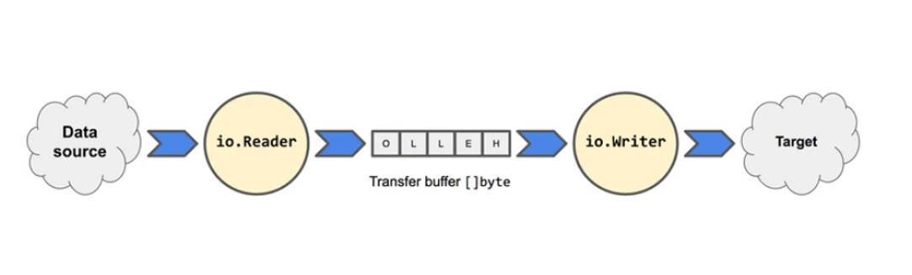

# I/O操作也叫输入输出操作
- 其中I是指Input，O是指Output
- 用于读或者写数据的，有些语言中也叫流操作，是指数据通信的通道。


# Go 输入和输出操作是使用原语实现的
- 这些原语将数据模拟成可读的或可写的字节流。
- Go 的 io 包提供了 io.Reader 和 io.Writer 接口
- 分别用于数据的输入和输出




# io库属于底层接口定义库
- 其作用是是定义一些基本接口和一些基本常量
- 一般用这个库只是为了调用它的一些常量，比如io.EOF


# io库比较常用的接口有三个，分别是Reader，Writer和Close。
- io库中实现的接口可以以流的方式高效处理数据，而不用考虑数据是什么，数据来自哪里，以及数据要发送到哪里的问题


## Reader
- io.Reader 表示一个读取器，它将数据从某个资源读取到传输缓冲区。在缓冲区中，数据可以被流式传输和使用。

```go
type Reader interface {
	Read(p []byte) (n int, err error)
}
```


- 对于要用作读取器的类型，它必须实现 io.Reader 接口的唯一一个方法 Read(p []byte)。
- 换句话说，只要实现了 Read(p []byte) ，那它就是一个读取器。
- Read() 方法有两个返回值，一个是读取到的字节数，一个是发生错误时的错误。
- 通过 string.NewReader(string) 创建一个字符串读取器，然后流式地按字节读取：

```go
package main

import (
	"io"
	"log"
	"os"
	"strings"
)

func main() {

	reader := strings.NewReader("xiaoyi 123dwd 123")
	// 每次读取4个字节
	p := make([]byte, 4)
	for {

		n, err := reader.Read(p)
		if err != nil {
			if err == io.EOF {
				log.Printf("读完了:eof错误 :%d", n)
				break
			}
			log.Printf("其他错误:%v", err)
			os.Exit(2)
		}
		log.Printf("[读取到的字节数为:%d][内容:%v]", n, string(p[:n]))
		log.Printf("[读取到的字节数为:%d][内容:%v]", n, string(p))
	}

}

/*
2021/08/31 08:29:16 [读取到的字节数为:4][内容:yi 1]
2021/08/31 08:29:16 [读取到的字节数为:4][内容:23dw]
2021/08/31 08:29:16 [读取到的字节数为:4][内容:23dw]
2021/08/31 08:29:16 [读取到的字节数为:4][内容:d 12]
2021/08/31 08:29:16 [读取到的字节数为:4][内容:d 12]

// 倒数第二次  p为d 12
// 倒数第1次  读取到3，p为 3 12
2021/08/31 08:29:16 [读取到的字节数为:1][内容:3]
2021/08/31 08:29:16 [读取到的字节数为:1][内容:3 12]
2021/08/31 08:29:16 读完了:eof错误 :0
*/
```


- 可以看到，最后一次返回的 n 值有可能小于缓冲区大小。
-  io.EOF 来表示输入流已经读取到头

> 查看strings.Reader.Read方法 文件在 C:\Program Files\Go\src\strings\reader.go
```go
func (r *Reader) Read(b []byte) (n int, err error) {
	if r.i >= int64(len(r.s)) {
		return 0, io.EOF
	}
	r.prevRune = -1
	n = copy(b, r.s[r.i:])
	r.i += int64(n)
	return
}
```

## 自己实现一个 strings.Reader
- 举例 a-z A-Z 

```go
package main

import "fmt"

//  举例 a-z A-Z

func alpha(r byte) byte{
	if (r>'A' && r<'Z') || (r>='a' && r<='z'){
		return r
	}
	return 0
}

func main() {

	fmt.Println(alpha('3'))
	fmt.Println(alpha('a'))
	fmt.Println(alpha('z'))
	fmt.Println(alpha('$'))

}


/*
0
97
122
0
*/
```


## 组合多个 Reader，目的是重用和屏蔽下层实现的复杂度
- 标准库已经实现了许多 Reader。
- `使用一个 Reader 作为另一个 Reader 的实现是一种常见的用法`。
- 这样做可以让一个 Reader 重用另一个 Reader 的逻辑，下面展示通过更新 alphaReader 以接受 io.Reader 作为其来源。

```go
package main

import (
	"fmt"
	"io"
	"log"
	"strings"
)

//  举例 a-z A-Z

type alphaReader struct{
	// 组合reader
	reader io.Reader
}

func (a *alphaReader) Read(p []byte) (int, error)  {
	// 调用io.Reader
	n, err := a.reader.Read(p)
	if err != nil{
		return n, err
	}

	// 自定义filter，过滤p的非字母
	buf := make([]byte, n)
	fmt.Println("初始的buf: ",buf)

	for i:=0; i<n; i++{
		if char :=alphaFilter(p[i]); char != 0{
			buf[i] = char
		}
	}

	// buf临时保存，copy到p
	fmt.Println("过滤后buf: ",buf)
	copy(p, buf)
	return n, nil

}

// 只保留字符串的a-Z
func alphaFilter(r byte) byte{
	if (r>'A' && r<'Z') || (r>='a' && r<='z'){
		return r
	}
	return 0
}

func main() {

	originReader := strings.NewReader("xiaohu 33d33 &()&^&*( rng mihu you")
	reader := alphaReader{
		reader: originReader,
	}

	p1 := make([] byte, 4)
	//p2 := make([]byte, 4)
	for {
		n1, err := reader.Read(p1)
		//_, err := originReader.Read(p2)  // 原生的Reader
		if err == io.EOF{
			break
		}

		log.Printf("[p1][内容:%v]", string(p1[:n1]))
		//log.Printf("[原生的][内容:%v]", string(p2[:n2]))
	}


}


/*
初始的buf:  [0 0 0 0]
过滤后buf:  [120 105 97 111]
初始的buf:  [0 0 0 0]
过滤后buf:  [104 117 0 0]
初始的buf:  [0 0 0 0]
过滤后buf:  [0 100 0 0]
初始的buf:  [0 0 0 0]
过滤后buf:  [0 0 0 0]
初始的buf:  [0 0 0 0]
过滤后buf:  [0 0 0 0]
初始的buf:  [0 0 0 0]
过滤后buf:  [0 0 114 110]
初始的buf:  [0 0 0 0]
过滤后buf:  [103 0 109 105]
初始的buf:  [0 0 0 0]
过滤后buf:  [104 117 0 121]
初始的buf:  [0 0]
过滤后buf:  [111 117]
2021/09/06 08:52:15 [p1][内容:xiao]
2021/09/06 08:52:15 [p1][内容:hu  ]
2021/09/06 08:52:15 [p1][内容: d  ]
2021/09/06 08:52:15 [p1][内容:    ]
2021/09/06 08:52:15 [p1][内容:    ]
2021/09/06 08:52:15 [p1][内容:  rn]
2021/09/06 08:52:15 [p1][内容:g mi]
2021/09/06 08:52:15 [p1][内容:hu y]
2021/09/06 08:52:15 [p1][内容:ou]

Process finished with the exit code 0


*/
```

## os.File 结合
- 以下代码展示了 alphaReader 如何与 os.File 结合以过滤掉文件中的非字母字符：
```go
package main

import (
	"fmt"
	"io"
	"log"
	"os"
)

var a byte = 0

type alphaReader struct {
	// 组合io.reader
	reader io.Reader
}

func (a *alphaReader) Read(p []byte) (int, error) {
	// 这里调用的是io.Reader
	n, err := a.reader.Read(p)
	if err != nil {
		return n, err
	}
	// 此时的p [xi@a] [xiao]
	buf := make([]byte, n)
	// buf = [0 0 0 0]
	fmt.Println(buf)
	for i := 0; i < n; i++ {
		if char := guolv(p[i]); char != 0 {
			buf[i] = char
		}
	}
	fmt.Println(buf)
	// buf = [79 68 0 65]
	copy(p, buf)
	return n, nil
}

// 只保留字符串中的字母字符 a-z A-Z
func guolv(r byte) byte {
	if (r >= 'A' && r <= 'Z') || (r >= 'a' && r <= 'z') {
		return r
	}
	return 0
}

func main() {
	file,err:=os.Open("a.txt")
	if err!=nil{
		return
	}
	//originReader := strings.NewReader("xiaoYX(@dakdwd[1213kwdwd!!")
	reader := alphaReader{
		reader: file,
	}
	p1 := make([]byte, 4)
	for {
		n1, err := reader.Read(p1)
		if err == io.EOF {
			break
		}
		log.Printf("[][内容:%v]", string(p1[:n1]))
	}
}

```


## Writer 
- io.Writer 表示一个编写器，它从缓冲区读取数据，并将数据写入目标资源。


- 对于要用作编写器的类型，必须实现 io.Writer 接口的唯一一个方法 Write(p []byte)
- 同样，只要实现了 Write(p []byte) ，那它就是一个编写器。
```go
type Writer interface {
    Write(p []byte) (n int, err error)
}
```
- Write() 方法有两个返回值，一个是写入到目标资源的字节数，一个是发生错误时的错误。
## bytes.Buffer库
- bytes.Buffer 的针对的是内存到内存的缓存

## closer
- 关闭
```go
type Closer interface {
    Close() error
}
```

# ioutil库 工具包
- ioutil库包含在io目录下，它的主要作用是`作为一个工具包`，里面有一些比较实用的函数
- 比如 `ReadAll(从某个源读取数据)、ReadFile（读取文件内容）、WriteFile（将数据写入文件）、ReadDir（获取目录）`
### readFile实例
- 举例
```go
package main

import (
	"fmt"
	"io/ioutil"
)

func main() {
	bytes, err := ioutil.ReadFile("go.mod")
	if err != nil {
		fmt.Println(err)
		return
	}
	fmt.Printf("%s", bytes)
	fmt.Printf("%v", string(bytes))
}


/*
   module day04

   go 1.16
   module day04

   go 1.16
*/
```

### writeFile 写入文件
- 举例
```
package main

import (
	"fmt"
	"io/ioutil"
)

func main() {
	fileName := "a.txt"
	err := ioutil.WriteFile(fileName, []byte("升职加薪\n迎娶白富美"), 0644)
	fmt.Println(err)
}

```

### readDir 读取目录下的文件元信息
- 举例

```go
package main

import (
	"io/ioutil"
	"log"
)

func main() {
	fs, _ := ioutil.ReadDir("./lugo03")

	for _, f := range fs {
		log.Printf("[name:%v][size:%v][mode:%v][modTime:%v]",
			f.Name(),
			f.Size(),
			f.Mode(),
			f.ModTime(),


		)
	}
}

```

# os库 操作系统打交道
## os.create 
- file.WriteString 和 file.Write,举例
```go
package main

import (
	"os"
)

func main() {
	file,_:=os.Create("b.txt")

	for i:=0;i<5;i++{
		file.WriteString("WriteString\n")
		file.Write([]byte("Write\n"))
	}
}

```

## os其他常用函数
- 举例
```go
package main

import (
	"log"
	"os"
)

func main() {
	hn, _ := os.Hostname()
	log.Printf("主机名:%v", hn)
	log.Printf("进程pid:%v", os.Getpid())
	log.Printf("命令行参数:%v", os.Args)
	log.Printf("获取GOROOT 环境变量:%v", os.Getenv("GOROOT"))

	for _, v := range os.Environ() {
		log.Printf("环境变量 %v", v)
	}
	dir,_:=os.Getwd()
	log.Printf("当前目录:%v", dir)
	log.Println("创建单一config目录")
	os.Mkdir("config",0755)
	log.Println("创建层级config1/yaml/local目录")
	os.MkdirAll("config1/yaml/local",0755)

	//log.Printf("删除单一文件或目录%v",os.Remove("config"))
	//log.Printf("删除层级文件或目录%v",os.RemoveAll("config1"))
}

```

## 读取文件 ioutil.ReadFile vs bufio 

- 举例

```go
package main

import (
	"bufio"
	"fmt"
	"io/ioutil"
	"os"
)

func main() {

	// 方式一
	bytes1, _ := ioutil.ReadFile("go.mod")

	// 方式二
	file, _ := os.Open("go.mod")
	bytes2, _ := ioutil.ReadAll(file)
	file.Close()

	// 方法三
	file, _ = os.Open("go.mod")

	bo := bufio.NewReader(file)  // 缓存
	buf := make([]byte, 200)
	bo.Read(buf)

	fmt.Println(string(bytes1))
	fmt.Println(string(bytes2))
	fmt.Println(string(buf))
}

```

- 两者都提供了对文件的读写功能，唯一的不同就是`bufio多了一层缓存的功能`，这个优势主要体现读取大文件的时候（`ioutil.ReadFile是一次性将内容加载到内存`，如果内容过大，很容易爆内存）

## 标准输出，标准输入
- os.Stdout.Write 替代fmt.print


###  os.stdin 作为脚本的输入内容
- 测试程序接收os.stdin作为执行脚本

- 真实生产应用 夜莺监控发送告警，调用python的send.py脚本 ，将发送的内容作为stdin传过去
    - go代码：https://github.com/didi/nightingale/blob/master/alert/consume.go#L183
    - python 脚本：https://github.com/didi/nightingale/blob/master/etc/script/notify.py