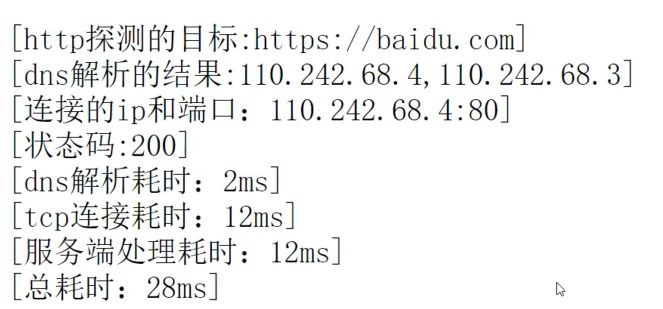

# 上次作业讲解

- 考察点：map增量更新+接口+结构体方法
    - jobManager 增量更新job
    - 要求写接口，有start stop hash三个方法
    - 写两个结构体，分别实现上述结构
    - 写一个jobmanager管理，要求有增量更新
    - 远端sync 
        - 本地有，远端没有，要删除
        - 本地没有，远端有，要新增
        - 本地有，远端有，不管


```go
package main

import (
	"fmt"
	"log"
	"strings"
	"sync"
	"time"
)

/*
考察点：map增量更新+接口+结构体方法

- jobManager 增量更新job
- 要求写接口，有start stop hash三个方法
- 写两个结构体，分别实现上述结构
- 写一个jobmanager管理，要求有增量更新
- 远端sync
  - 本地有，远端没有，要删除
  - 本地没有，远端有，要新增
  - 本地有，远端有，不管
*/

/*
编写过程

1、先写接口
2、至少两个结构体实现这些接口
	- 先写结构体
	- 绑定接口中的方法
3、有1个JobMange的结构体，有1个对应的变量，作用管理
	- actionJobs是1个map，hold住上次常驻的job
4、要有1个远端sync方法，触发增量更新
	- go： 定时去mysql中查询

*/


/**
jobManage
 */
type jobManager struct {
	targetMtx sync.RWMutex
	activeJobs map[string] job
}

// 打印jobManager的详情
func (jm *jobManager) getDetail()  {
	ks := []string{}
	hs := []string{}

	jm.targetMtx.RLock()
	for _,v := range jm.activeJobs{
		if strings.HasPrefix(v.hash(), "k8s"){
			ks = append(ks, v.hash())
		}else{
			hs = append(hs, v.hash())
		}
	}
	jm.targetMtx.RUnlock()

	log.Printf("[k8s: %d][k8s.detail:%s]", len(ks), strings.Join(ks, ","))
	log.Printf("[host: %d][host.detail:%s]", len(hs), strings.Join(hs, ","))
}

// 增量更新的逻辑  jobs同步过来的远端数据
func (jm *jobManager) sync(jobs []job)  {
	// 待开启的, 最后ok的数据
	thisNewJobs := make(map[string] job)
	// 远端全量的，远端mysql中全量数据，保存的jobs
	thisAllJobs := make(map[string] job)
	// jm.activeJobs, 旧数据，要进行增删改的

	// 判断本次新的 python set(a) - set(b)
	jm.targetMtx.Lock()
	for _,j := range jobs{
		hash := j.hash()
		thisAllJobs[hash] = j

		//不存在，是个新job
		if _, loaded := jm.activeJobs[hash]; !loaded{
			thisNewJobs[hash] = j
			jm.activeJobs[hash] = j
		}
	}

	// 判断旧的，并删除
	for hash, t := range jm.activeJobs{
		if _, loaded := thisAllJobs[hash]; !loaded{
			// 说明我是旧的
			t.stop()
			delete(jm.activeJobs, hash)
		}
	}
	jm.targetMtx.Unlock()

	// 开启本次新的jobs  newJob.start
	for _,t := range thisNewJobs{
		t.start()
	}
	jm.getDetail()
}


/*
1个接口
2个结构体
3个方法
*/
type job interface {
	start()
	stop()
	hash() string
}


type k8sJob struct {
	Id int
	Name string
	NameSpace string
}

type hostJob struct{
	Id int
	Name string
	HostIp string
}

func (kj *k8sJob) start()  {
	log.Printf("[k8s.job.start][%v]",kj)
}
func (kj *k8sJob) stop()  {
	log.Printf("[k8s.job.stop][%v]",kj)
}
func (kj *k8sJob) hash() string {
	return "k8s" + kj.Name
}

func (hj *hostJob) start()  {
	log.Printf("[host.job.start][%v]",hj)
}
func (hj *hostJob) stop()  {
	log.Printf("[host.job.stop][%v]",hj)
}
func (hj *hostJob) hash() string {
	return "host" + hj.Name
}

func main()  {
	jm := &jobManager{
		activeJobs: make(map[string] job),
	}

	// 第1次，造数据k8sJobs，sync
	jobs := make([]job, 0)
	for i := 0; i < 3; i++ {
		name := fmt.Sprintf("k8s_job_%d", i)
		nameSpace := fmt.Sprintf("namespace_%d", i)
		kj := k8sJob{
			Id:i,
			Name: name,
			NameSpace: nameSpace,
		}
		jobs = append(jobs, &kj)
	}
	for i := 0; i < 3; i++ {
		name := fmt.Sprintf("host_job_%d", i)
		ip := fmt.Sprintf("1.1.1.%d", i)
		hj := hostJob{
			Id:i,
			Name: name,
			HostIp: ip,
		}
		jobs = append(jobs, &hj)
	}
	log.Printf("[分配给我6个job，部署3个k8s 3个host]")
	log.Println(jobs)
	jm.sync(jobs)
	
	time.Sleep(5*time.Second)
	log.Printf("[等待5秒，下一轮分配]")

	
	// 第2次造数据
	jobs2 := make([]job, 0)
	for i := 1; i < 6; i++ {
		name := fmt.Sprintf("k8s_job_%d", i)
		namespace := fmt.Sprintf("namespace_%d", i)
		j := k8sJob{
			Id:           i,
			Name:         name,
			NameSpace: namespace,
		}
		jobs2 = append(jobs2, &j)
	}
	log.Printf("[分配给我5个job，部署5个k8s]")
	jm.sync(jobs2)

	time.Sleep(5 * time.Second)
	log.Printf("[等待5秒，下一轮分配]")

	// 第3次造数据
	jobs3 := make([]job, 0)

	for i := 2; i < 5; i++ {
		name := fmt.Sprintf("host_job_%d", i)
		ip := fmt.Sprintf("1.1.1.%d", i)
		j := hostJob{
			Id:     i,
			Name:   name,
			HostIp: ip,
		}
		jobs3 = append(jobs3, &j)
	}
	log.Printf("[分配给我3个job， 3个host]")
	jm.sync(jobs3)


}


/*
2021/09/13 22:24:21 [分配给我6个job，部署3个k8s 3个host]
2021/09/13 22:24:21 [0xc00007a3f0 0xc00007a420 0xc00007a450 0xc00007a480 0xc00007a4b0 0xc00007a4e0]
2021/09/13 22:24:21 [k8s.job.start][&{0 k8s_job_0 namespace_0}]
2021/09/13 22:24:21 [k8s.job.start][&{1 k8s_job_1 namespace_1}]
2021/09/13 22:24:21 [k8s.job.start][&{2 k8s_job_2 namespace_2}]
2021/09/13 22:24:21 [host.job.start][&{0 host_job_0 1.1.1.0}]
2021/09/13 22:24:21 [host.job.start][&{1 host_job_1 1.1.1.1}]
2021/09/13 22:24:21 [host.job.start][&{2 host_job_2 1.1.1.2}]
2021/09/13 22:24:21 [k8s: 3][k8s.detail:k8sk8s_job_0,k8sk8s_job_1,k8sk8s_job_2]
2021/09/13 22:24:21 [host: 3][host.detail:hosthost_job_2,hosthost_job_0,hosthost_job_1]


2021/09/13 22:24:26 [等待5秒，下一轮分配]
2021/09/13 22:24:26 [分配给我5个job，部署5个k8s]
2021/09/13 22:24:26 [host.job.stop][&{2 host_job_2 1.1.1.2}]
2021/09/13 22:24:26 [k8s.job.stop][&{0 k8s_job_0 namespace_0}]
2021/09/13 22:24:26 [host.job.stop][&{0 host_job_0 1.1.1.0}]
2021/09/13 22:24:26 [host.job.stop][&{1 host_job_1 1.1.1.1}]
2021/09/13 22:24:26 [k8s.job.start][&{5 k8s_job_5 namespace_5}]
2021/09/13 22:24:26 [k8s.job.start][&{3 k8s_job_3 namespace_3}]
2021/09/13 22:24:26 [k8s.job.start][&{4 k8s_job_4 namespace_4}]
2021/09/13 22:24:26 [k8s: 5][k8s.detail:k8sk8s_job_1,k8sk8s_job_2,k8sk8s_job_4,k8sk8s_job_3,k8sk8s_job_5]
2021/09/13 22:24:26 [host: 0][host.detail:]


2021/09/13 22:24:31 [等待5秒，下一轮分配]
2021/09/13 22:24:31 [分配给我3个job， 3个host]
2021/09/13 22:24:31 [k8s.job.stop][&{3 k8s_job_3 namespace_3}]
2021/09/13 22:24:31 [k8s.job.stop][&{5 k8s_job_5 namespace_5}]
2021/09/13 22:24:31 [k8s.job.stop][&{1 k8s_job_1 namespace_1}]
2021/09/13 22:24:31 [k8s.job.stop][&{2 k8s_job_2 namespace_2}]
2021/09/13 22:24:31 [k8s.job.stop][&{4 k8s_job_4 namespace_4}]
2021/09/13 22:24:31 [host.job.start][&{2 host_job_2 1.1.1.2}]
2021/09/13 22:24:31 [host.job.start][&{3 host_job_3 1.1.1.3}]
2021/09/13 22:24:31 [host.job.start][&{4 host_job_4 1.1.1.4}]
2021/09/13 22:24:31 [k8s: 0][k8s.detail:]
2021/09/13 22:24:31 [host: 3][host.detail:hosthost_job_3,hosthost_job_2,hosthost_job_4]

Process finished with the exit code 0

*/
```


# 今天的内容大纲

- write 和 stdin stderr stdout
- 反射
- 包与工程
- 单元测试和基准测试


# 今天的内容重点
- `上次的map增量更新+接口+结构体方法`   绝对重点
- `包和工程`  绝对重点
- 单测 一般


# 今天的作业

## 作业 1 
- 写一个自己的常用工具包，推送到github
- 有v1.0.1 v1.0.2 版本
- 有v2.0.1 是一个不兼容的大版本变更
- 使用方使用两个版本共存 v1.0.2 ,v2.0.1


## 作业 2
- 用 net/http/httptrace  `写个http耗时探测的项目 `  simple-http-probe
- gin写一个web /probe/http?host=baidu.com&is_https=1
- host代表探测的地址或ip
- is_https=1代表探测 https://baidu.com否则是  http://baidu.com
- 返回探测的结果
    - 域名的ip
    - status_code
    - http各阶段的耗时
- 需要一个yaml解析的配置
    - http的listen的地址
    - 探测超时时间
- 总的来说就是实现上述工程，go mod管理



# 下一节要讲什么内容
- 单元测试和基准测试
- time
- 日志
- prrof
- 加解密? 